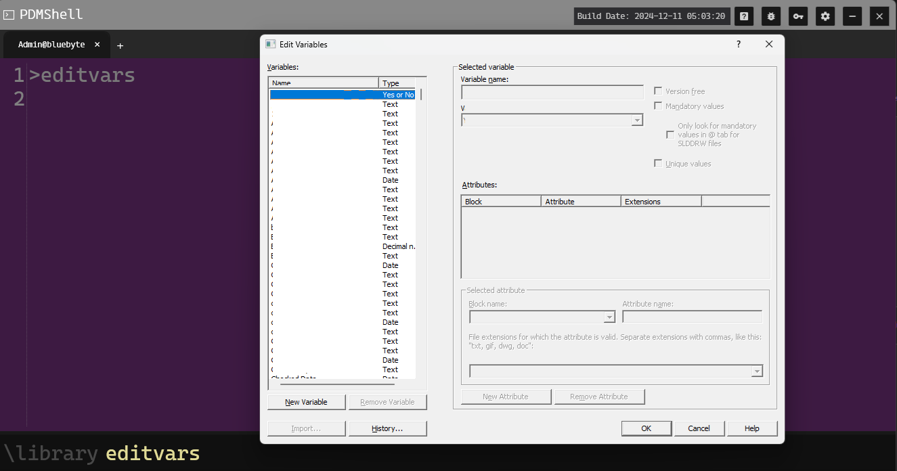

# EDITVARS Command Documentation

## DESCRIPTION:
Opens the PDM variable editor.

## SYNTAX:
```bash 
editvars
```
## PARAMETERS:
None

## EXAMPLES:
```bash
editvars
# open the PDM variable editor 
```
## TUTORIAL:
