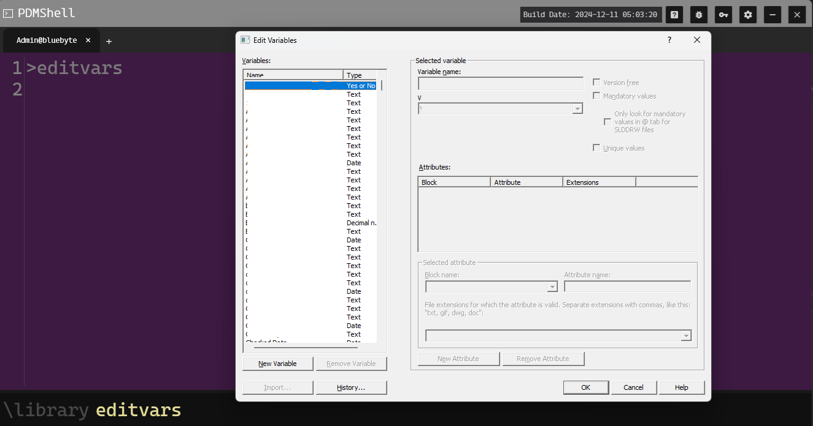

# editvars
## Description
Opens the PDM variable editor.

## Syntax
```bash 
editvars
```
## Parameters
None

## Examples
```bash
editvars
# editvars
```
## Tutorial


## Availability
Available since PDMShell 2.0.0.
