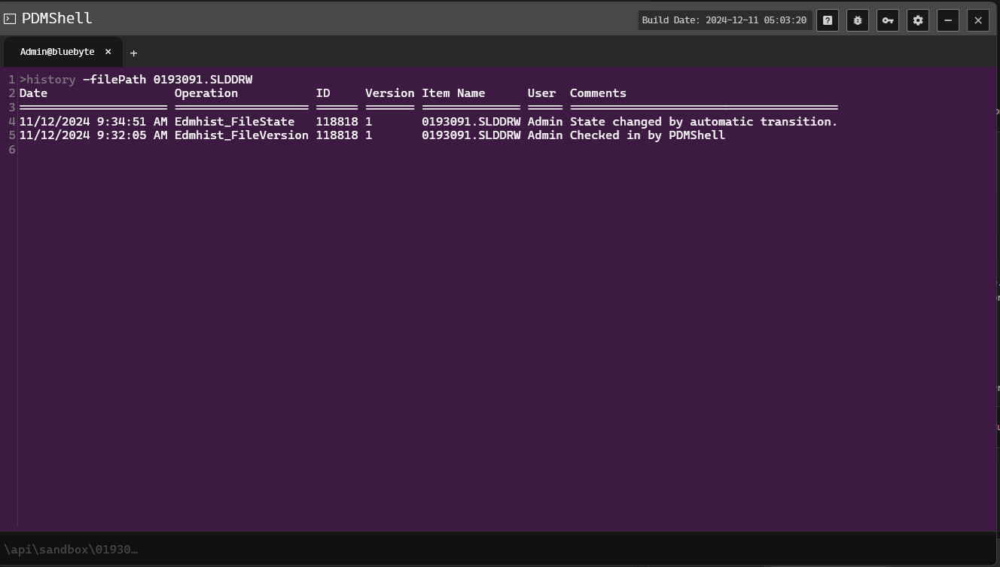

# HISTORY Command Documentation

## DESCRIPTION:
Prints the history of a file.

## SYNTAX:
history [-s search] [-f filePath]

## PARAMETERS:
-s search - The search operation to use.
-f filePath - The file to get the history for.

## EXAMPLES:
history -f "file1.sldprt"

## REMARKS:
- The search parameter searches the current directory and does not drill down. The search query is a PDM one, so you can use `%` for wildcard.

## PREVIEW:
