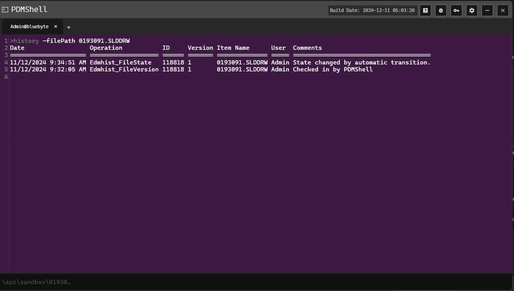

# HISTORY Command
## Description
Prints the history of a file.

## Syntax
```bash
history [-search|-filePath] 
```
## Parameters
- `search`:  The search operation to use.

- `filePath`: The file to get the history for.

## Examples
```bash
history -f "file1.sldprt"
# lists the history of file1
```
## Remarks
- The search parameter searches the current directory and does not drill down. The search query is a PDM one, so you can use `%` for wildcard.


## PREVIEW:


## Availability
Available since PDMShell 2.0.0 or earlier.
