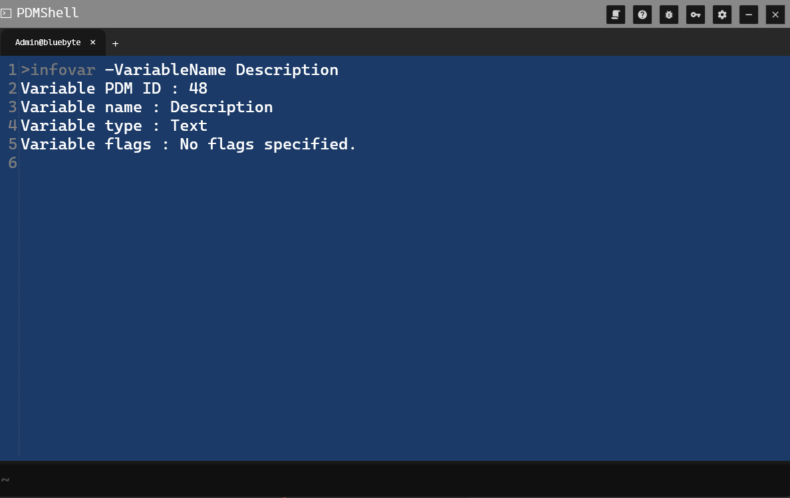

# INFOVAR Command Documentation

## DESCRIPTION:
Gets information about a variable.

## SYNTAX:
infovar [-v variable_name]

## PARAMETERS:
-v variable_name - The variable name to retrieve information for.

## EXAMPLES:
infovar -v Description

## Preview 

