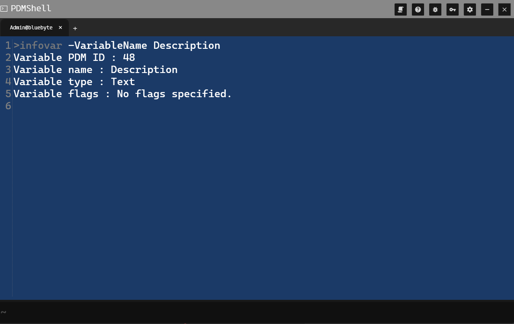

# INFOVAR Command
## Description
Gets information about a variable.

## Syntax
```bash
infovar -variableName
```

## Parameters
- `variableName`: The variable name to retrieve information for.

## Examples
infovar -v Description


## Preview 



## Availability
Available since PDMShell 2.0.0 or earlier.
