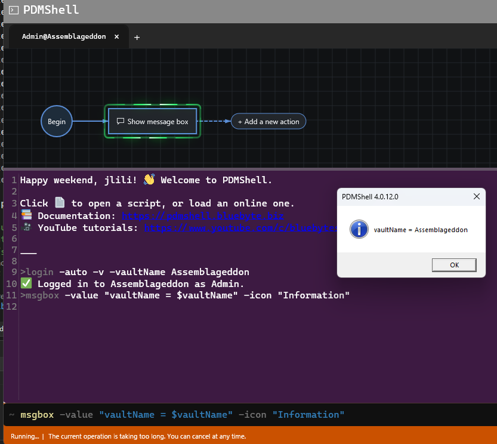

# MSGBOX Command
## Description
The `msgbox` command shows a Windows message box with the specified text.

Use `msgbox` in scripts when you need to display a simple notification or checkpoint message to the user.

## Syntax
```bash
msgbox -value message [-title title] [-icon icon]
```

## Parameters
- `value`:  
  *(Required)* Message text to display in the message box.

- `title`:  
  *(Optional)* Message box title. If omitted, PDMShell uses the current PDMShell version as the title.

- `icon`:  
  *(Optional)* Message box icon. Valid values are `None`, `Information`, `Warning`, `Error`, and `Question`. If omitted, PDMShell uses `Information`.

## Visual Editor
In the visual editor command builder, the `icon` parameter is shown as a single-select combo box with the supported icon values:

- `None`
- `Information`
- `Warning`
- `Error`
- `Question`

## Placeholders
The `value` and `title` parameters support session placeholders. PDMShell evaluates placeholders before showing the message box, so you can display values from the current session in the message text.

For example, after logging in to a vault, `$vaultName` resolves to the active vault name:

```bash
msgbox -value "vaultName = $vaultName" -icon "Information"
```



Common session placeholders include `$vaultName`, `$date`, `$time`, `$guid`, and `$tempFolder`.

## Examples
```bash
msgbox -value "Hello from PDMShell"
```

```bash
msgbox -value "Script completed successfully." -title "Batch Complete" -icon Information
```

```bash
msgbox -value "The export failed." -title "Export Error" -icon Error
```

## Remarks
- The command displays an informational Windows message box.
- When `title` is not specified, the message box title defaults to the PDMShell version.
- When `icon` is not specified, the message box uses the `Information` icon.
- Wrap the value in quotes when the message contains spaces.
- Wrap the title in quotes when it contains spaces.
- The script continues after the user closes the message box.

## Availability
Available since PDMShell 4.0.8.

## Last Updated
Updated in PDMShell 4.0.14 so `value` and `title` support session-level placeholders such as `$vaultName`, `$date`, `$time`, `$guid`, and `$tempFolder`.
