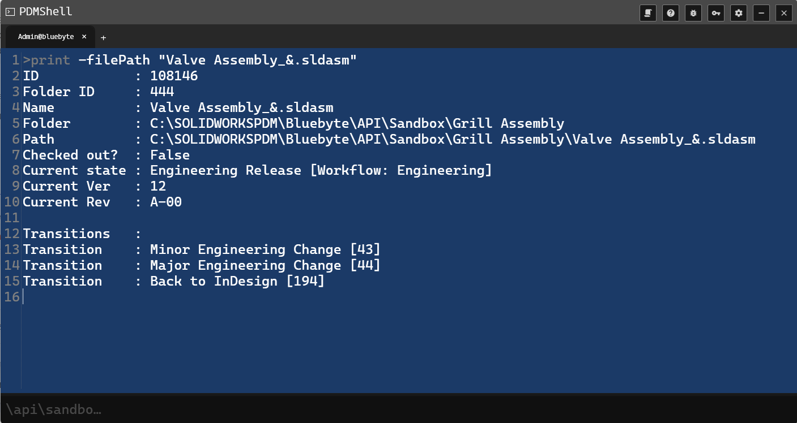

# PRINT Command Documentation

## DESCRIPTION:
Displays the biographical information about the specified file.

## SYNTAX:
print [-f file]

## PARAMETERS:
-f file - The file to print biographical information for.

## EXAMPLES:
print -f file1.sldprt

## PREVIEW

