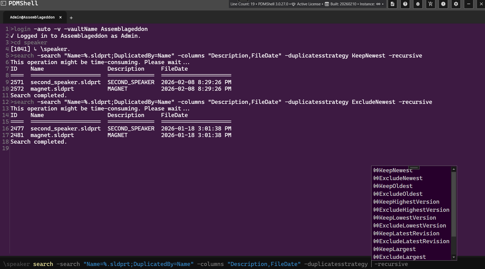

# SEARCH Command Documentation

## DESCRIPTION:
The `search` command allows users to search for files and folders in the current directory. It supports recursive searches, filtering, and output customization.

## SYNTAX:
```bash
search -search -recursive -includesubfolders -csv -columns -duplicatesstrategy
```

## PARAMETERS:
- `search`: Search keyword. This supports SQL wildcard %.

- `recursive`: Searches through all subdirectories recursively.

- `includesubfolders`: Includes subfolders in the search results.

- `csv`: Outputs the search results in CSV format.

- `columns`: Specifies the columns to include in the output seperated by a comma.

- `duplicatesstrategy`: Defines how duplicate results are resolved when DuplicatedBy is specified in the search query. You must `DuplicatedBy` token in the `search` parameter. 

>[!NOTE]
> **Special columns**: You can use `FileDate`, `Version`, `State` and `Hash` to list information that is not captured in the datacard. This is useful when searching for duplicates. The hash requires that the file be locally cached. Example:

```bash 
## lists all duplicates in the current directory by name and prints their file date, hash and revision
search -search "Name=%.sld%;Recursive=true;DuplicatedBy=Name" -columns "FileDate,Hash,Revision"
```

>[!NOTE]
> We have introduced Advanced Search capabilities that can be used in the `-search` parameter. Please see more information [here](advancedsearch.md).


## EXAMPLES:
### Example 1: Basic Search
```bash
search -search % # prints all the files in the current directory
```
Performs a basic search in the current directory.

### Example 2: Recursive Search with Subfolders
```bash
search -search -recursive -includesubfolders # prints all the files and folders in the current directory
```
Searches all files and folders, including subdirectories.

### Example 3: Export Results to CSV
```bash
search -search -csv -columns "Description,PartNumber" # Prints all the files in the current directory with their descriptions and part numbers
```
Exports the search results to a CSV file with specified columns.


## DUPLICATE STRATEGY OPTIONS

The following strategies are supported for the `-duplicatesstrategy` parameter:

| Strategy | Description |
|-----------|-------------|
| KeepNewest | Keeps the newest file in each duplicate group. |
| ExcludeNewest | Excludes the newest file and keeps the remaining duplicates. |
| KeepOldest | Keeps the oldest file in each duplicate group. |
| ExcludeOldest | Excludes the oldest file and keeps the remaining duplicates. |
| KeepHighestVersion | Keeps the file with the highest PDM version. |
| ExcludeHighestVersion | Excludes the file with the highest PDM version. |
| KeepLowestVersion | Keeps the file with the lowest PDM version. |
| ExcludeLowestVersion | Excludes the file with the lowest PDM version. |
| KeepLatestRevision | Keeps the file with the latest revision value. |
| ExcludeLatestRevision | Excludes the file with the latest revision value. |
| KeepLargest | Keeps the file with the largest file size. |
| ExcludeLargest | Excludes the file with the largest file size. |
| KeepSmallest | Keeps the file with the smallest file size. |
| ExcludeSmallest | Excludes the file with the smallest file size. |

```bash
## Lists all duplicates in the current directory by name and prints their file date, hash and revision
search -search "Name=%.sld%;Recursive=true;DuplicatedBy=Name" -duplicatesstrategy KeepNewest -columns "FileDate,Hash,Revision"
```




## NOTES:
- Ensure the current directory is set correctly before running the command.
- Use the `-columns` parameter to customize the output format. Data is pulled from @ for configuration-supported documents.

## TUTORIAL:
 <video src="https://bluebyte.biz/wp-content/pdmshellvideos/search.mp4" autoplay muted controls style="width: 100%; border-radius: 12px;"></video>
