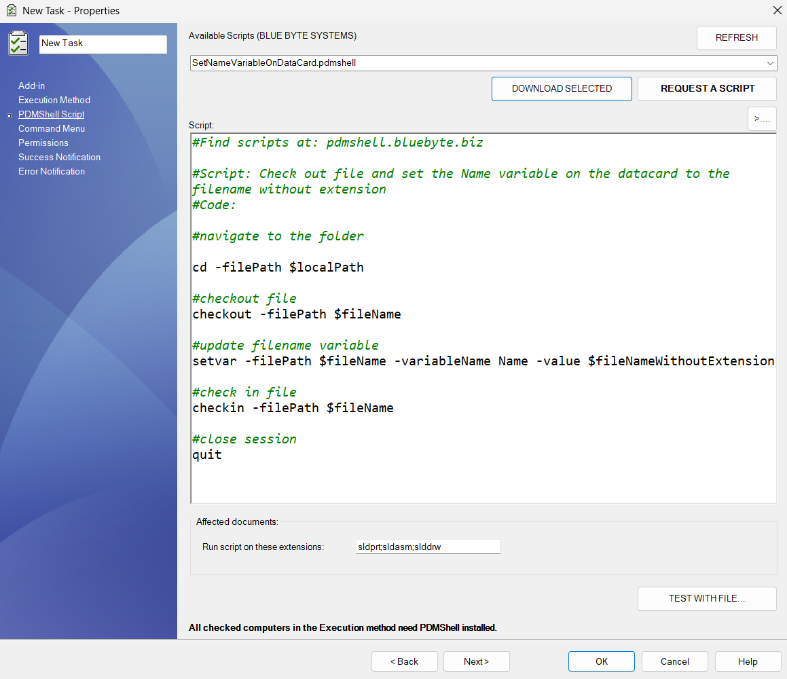

## Overview


<iframe width="800" height="600" src="https://www.youtube.com/embed/z2UYgREIRpA?si=vD4PfErfZtUb8-cm" title="YouTube video player" frameborder="0" allow="accelerometer; autoplay; clipboard-write; encrypted-media; gyroscope; picture-in-picture; web-share" referrerpolicy="strict-origin-when-cross-origin" allowfullscreen></iframe>

>[!Note]
> **This task can be requested upon purchase of a premium license of PDMShell.** To request after purchase, please send an email to support@bluebytesystemsinc.zohodesk.com


---

**TaskScript** is a custom PDM task add-in developed by **Blue Byte Systems Inc.** that allows you to execute **PDMShell scripts** the same way you would use the built-in **Convert** task.

With TaskScript, administrators can create configurable tasks that run custom `.pdmshell` scripts using the `pdmcli` engine on selected files within the vault.



---

## Key Features

- Execute PDMShell commands in response to PDM task triggers
- Dynamic script editing and variable binding
- Reuses existing scripts stored locally or downloaded
- Supports file filtering based on extensions
- Evaluates placeholders like `$fileName`, `$localPath`, and more
- Handles script failure with detailed logging

---

## Example Script

```bash
cd/
print -id $id
```

You can request a script by emailing us via the Request Script button.


## Remarks

- You can include the extensions: `sldprt;sldasm;slddrw` are the default value.
- TaskScript will run PDMShell sessions on all affected documents by the task.
- Do not forget to set the Command Menu tab.

## Placeholder Variables

TaskScript supports dynamic variables that are replaced at runtime for each selected file. Below is a list of available placeholders:

| Placeholder                  | Description                                              |
|-----------------------------|----------------------------------------------------------|
| `$localPath`                | Full local path to the selected file                    |
| `$fileName`                 | File name (including extension)                         |
| `$id`                       | Internal PDM file ID                                     |
| `$folderPath`               | Full local path to the file's parent folder             |
| `$folderID`                 | Internal PDM folder ID                                   |
| `$fileNameWithoutExtension` | File name without the extension                          |
| `$vaultName`                | Name of the vault the file belongs to                   |
| `$vaultRootFolder`          | Local root path of the vault                            |
| `$(Variable.Configuration)` | Value of a custom PDM variable for a given configuration |

## $(Variable.Configuration)
- Use `@` for the `@` tab. Example: `$(Description.@)`
- Use empty string for files with no configurations. Example: `$(Description. )`


