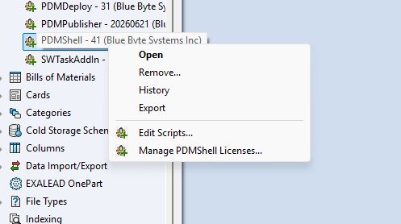
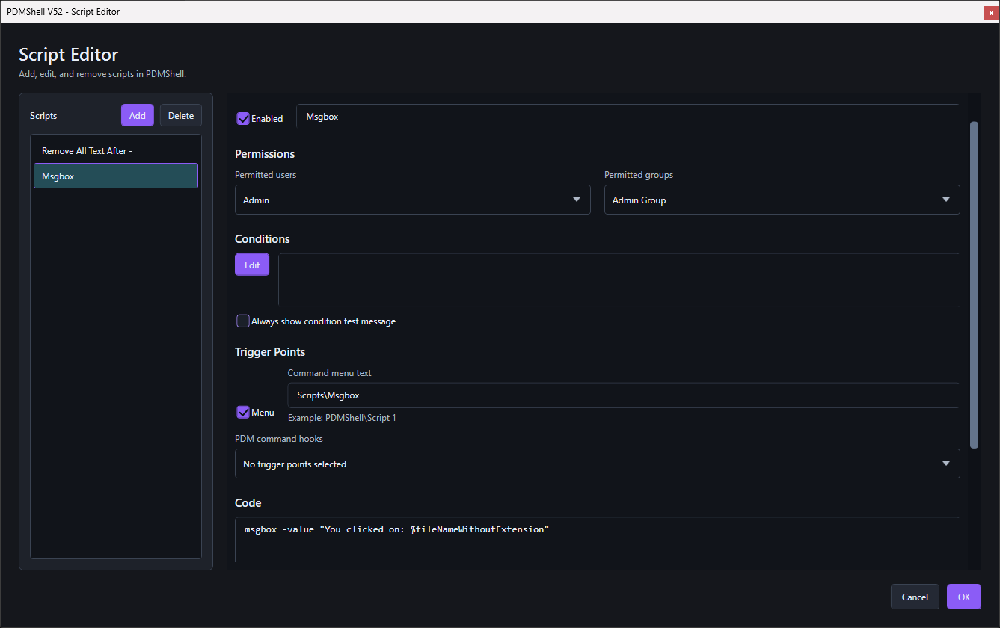

# PDMShell add-in

The PDMShell add-in lets SOLIDWORKS PDM administrators run `.pdmshell` scripts directly from PDM menus and PDM event trigger points. It is designed for the same class of automation normally handled with Dispatch: user commands, event-driven rules, file and folder automation, condition checks, and administrator-controlled deployment.

Instead of building automation from a fixed list of Dispatch actions, the add-in runs PDMShell scripts. This gives administrators access to the PDMShell command engine, the visual script editor, placeholders, PDM variables, and headless execution through `pdmcli.exe`.

> [!TIP]
> Need help building scripts or automation workflows? Blue Byte Systems offers [Enterprise Support Services](https://bluebyte.biz/product/enterprise-support-services/) for customers who want help designing, developing, or troubleshooting PDMShell automation.

>[!Note]
> The PDMShell add-in is included with the premium version. You can download it from your Blue Byte Systems Inc [account](https://bluebyte.biz/account) or deploy it with [PDMDeploy](https://docs.bluebyte.biz/src/cdpdm.html).
>
> If the vault is in a restricted or air-gapped environment that only allows Microsoft-hosted links, use the add-in's `PDMShell Download Center...` menu command to open the Microsoft SharePoint folder that contains PDMShell `.cex` files.

## Add-in menu commands

Open the SOLIDWORKS PDM Administration Tool, expand the vault, open the add-ins list, locate the PDMShell add-in, and right-click it to open the add-in menu.

  

The add-in menu includes:

- `Edit Scripts...` to open the Script Editor.
- `Manage PDMShell Licenses...` for online and offline license management.
- `PDMShell Download Center...` for restricted systems that need Microsoft-hosted `.cex` downloads.

## Add-in workflow

Select `Edit Scripts...` from the add-in menu to open the Script Editor.

The Script Editor is where administrators create script entries, enable them, assign permitted users and groups, define conditions, configure command menu text, select PDM command hooks, and edit the PDMShell script code.

  

Each script can also expose a PDM command menu item and store the PDMShell code that runs against the selected file, folder, or event context.

  

Use the Conditions editor to build the same condition expressions used by PDMShell scripts, then save the expression back to the add-in script.

  

## What you can automate

- Add right-click commands such as `PDMShell\Rename Files`.
- Create SOLIDWORKS PDM Tasks that run PDMShell scripts, similar to the built-in Convert task.
- Run scripts before or after checkout, check-in, undo checkout, state change, add, delete, move, copy, rename, get, label, card button, and folder commands.
- Restrict scripts to selected PDM users or groups.
- Validate conditions before a script runs.
- Pass selected files and folders to PDMShell with `runscript -items`.
- Test condition values with a message before enabling production automation.

## Documentation

| Article | Use it for |
| --- | --- |
| [PDMShell add-in installation](addin/installation.md) | Loading the add-in, opening the Script Editor, and using the Microsoft-hosted Download Center |
| [Manage add-in licenses](addin/license-manager.md) | Managing PDMShell add-in license keys from the PDM Administration Tool |
| [License Pool](license-pool.md) | Managing pooled vault licenses for add-in automation |
| [Machine License](machine-license.md) | Using the local workstation license for add-in automation |
| [Script Editor](addin/script-editor.md) | Creating, cloning, saving, and editing script entries |
| [Permissions](addin/permissions.md) | Limiting scripts to users and groups |
| [Conditions](addin/conditions.md) | Building wait-style condition expressions |
| [Command menu scripts](addin/command-menu.md) | Adding right-click PDM menu commands |
| [PDM Tasks](addin/tasks.md) | Creating SOLIDWORKS PDM Tasks that run PDMShell scripts |
| [Event trigger points](addin/trigger-points.md) | Running scripts from PDM command hooks |
| [Placeholders and command context](addin/placeholders.md) | Using file, folder, command, and variable placeholders |
| [Runtime execution](addin/runtime-execution.md) | Understanding `pdmcli.exe`, headless mode, and `-items` |
| [Testing and troubleshooting](addin/troubleshooting.md) | Validating scripts and diagnosing common issues |

## Dispatch comparison

Dispatch action scripts typically combine triggers, conditions, variables, and actions. The PDMShell add-in uses a similar administrator workflow, but the action body is a PDMShell script.

| Dispatch idea | PDMShell add-in equivalent |
| --- | --- |
| Action script | A configured PDMShell script |
| Administrative action | Script configured in the Script Editor |
| Menu command activation | Menu trigger with command menu text |
| PDM task | PDMShell task add-in running a `.pdmshell` script |
| PDM event activation | Trigger points such as checkout, check-in, state change, add, delete, move, copy, rename, and folder events |
| Conditions | PDMShell wait-style condition expression |
| Variables | PDMShell placeholders and PDM variable placeholders |
| Shell execute action | `pdmcli.exe` running the configured `.pdmshell` script |
| Debugging a script | Condition test message, visual script editor, and standalone `pdmcli.exe -edit` |

## Recommended rollout

1. Build and test the `.pdmshell` script outside the add-in.
2. Add the script in the Script Editor.
3. Enable the condition test message while validating conditions.
4. Configure permissions for a small administrator group first.
5. Enable a command menu or trigger point.
6. Test against a small set of files.
7. Expand permissions after the automation behaves as expected.
