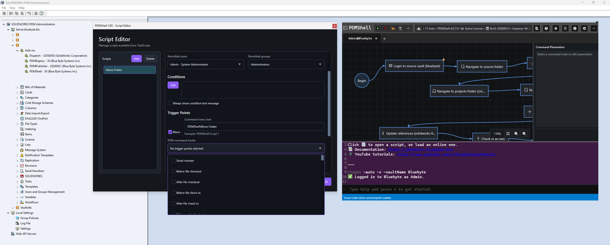

## Overview

<div style="position: relative; padding-bottom: 42.1875%; height: 0;"><iframe src="https://www.loom.com/embed/9503c0835345445aa71254736e07e402" frameborder="0" webkitallowfullscreen mozallowfullscreen allowfullscreen style="position: absolute; top: 0; left: 0; width: 100%; height: 100%;"></iframe></div>

---

The **PDMShell add-in** is a SOLIDWORKS PDM add-in developed by **Blue Byte Systems Inc.** that lets administrators run **PDMShell scripts** from PDM, similar to Dispatch but with PDMShell's visual script editor and command engine.

>[!Note]
> The PDMShell add-in is found in your Blue Byte Systems Inc [account](https://bluebyte.biz/account) for users with the premium version (active license). You can also download the add-in using [PDMDeploy](https://docs.bluebyte.biz/src/cdpdm.html).

With the PDMShell add-in, administrators can create configurable scripts that run custom `.pdmshell` workflows against selected files and folders in the vault.



## Script Configuration

Each script can be configured with:

- permitted users and groups
- conditions that decide whether the script is available or allowed to run
- right-click command menu text
- PDM command hooks and event trigger points

This lets the PDMShell add-in cover workflows that are normally handled by Dispatch, while keeping the script logic in PDMShell.

## Headless Mode

The PDMShell add-in can run PDMShell in headless mode for add-in automation. Headless mode starts a lighter `PDMShell Headless` shell, hides visual-editor controls that are not needed while a script is running, and skips visual-only startup work.

Use headless mode when a script is launched by a PDM task or another unattended automation flow:

```bash
pdmcli.exe -headless "C:\Vault\Scripts\CreateECO.pdmshell" -items "123,45;678,90"
```

You can also enable **Headless** in PDMShell settings so add-in and other command-line launches use headless mode when no command-line headless argument is supplied.

## Key Features

- Execute PDMShell commands from PDM right-click menus
- Execute PDMShell commands in response to PDM event triggers
- Restrict scripts to selected users and groups
- Add conditions that control when scripts are available or can run
- Dynamic script editing and variable binding
- Reuses existing scripts stored locally or downloaded
- Supports file filtering based on extensions
- Evaluates placeholders like `$fileName`, `$localPath`, and more
- Handles script failure with detailed logging


## Remarks

- You can include the extensions: `sldprt;sldasm;slddrw` are the default value.
- The PDMShell add-in will run PDMShell sessions on the affected documents.
- Do not forget to set the Command Menu tab.

## Placeholder Variables

The PDMShell add-in supports dynamic variables that are replaced at runtime for each selected file. Below is a list of available placeholders:

| Placeholder                  | Description                                                      |
|-----------------------------|------------------------------------------------------------------|
| `$localPath`                | Full local path to the selected file                            |
| `$fileName`                 | File name (including extension)                                 |
| `$fileNameWithoutExtension` | File name without the extension                                 |
| `$name`                     | Alias for file name                                             |
| `$extension`                | File extension                                                  |
| `$id`                       | Internal PDM file ID                                            |
| `$GUID`                     | Unique Identifier                                               |
| `$taskName`                 | Name of the running task                                        |
| `$folderPath`               | Full local path to the file's parent folder                     |
| `$folderID`                 | Internal PDM folder ID                                          |
| `$vaultName`                | Name of the vault the file belongs to                           |
| `$vaultRootFolder`          | Local root path of the vault                                    |
| `$(Variable.Configuration)` | Value of a custom PDM variable for a given configuration        |
| `$machineName`              | Name of the current machine                                     |
| `$computerName`             | Alias for machine name                                          |
| `$userName`                 | Logged-in PDM user name                                         |
| `$windowsUser`              | Windows user name                                               |
| `$userDomain`               | Windows domain name                                             |
| `$domain`                   | Alias for domain name                                           |
| `$yyyy`                     | Current year (4 digits)                                         |
| `$yy`                       | Current year (2 digits)                                         |
| `$MM`                       | Month (2 digits)                                                |
| `$M`                        | Month (no leading zero)                                         |
| `$dd`                       | Day (2 digits)                                                  |
| `$d`                        | Day (no leading zero)                                           |
| `$month`                    | Full month name (e.g., January)                                 |
| `$mon`                      | Short month name (e.g., Jan)                                    |
| `$day`                      | Full day name (e.g., Monday)                                    |
| `$dayShort`                 | Short day name (e.g., Mon)                                      |
| `$HH`                       | Hour (24-hour format)                                           |
| `$hh`                       | Hour (12-hour format)                                           |
| `$mm`                       | Minutes                                                        |
| `$ss`                       | Seconds                                                        |
| `$tt`                       | AM/PM designator                                               |
| `$timestamp`                | Combined date and time (yyyyMMdd_HHmmss)                        |
| `$date`                     | Current date (yyyy-MM-dd)                                       |
| `$time`                     | Current time (HH-mm-ss)                                         |

## $(Variable.Configuration)
- Use `@` for the `@` tab. Example: `$(Description.@)`
- Use empty string for files with no configurations. Example: `$(Description. )`


 
