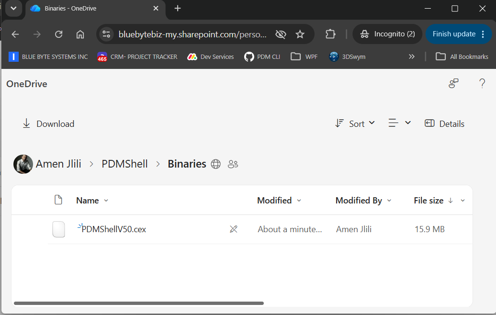

# PDMShell add-in installation

Install the PDMShell add-in in the SOLIDWORKS PDM vault where the automation should run. The add-in is available with the premium version of PDMShell and can be deployed from your Blue Byte Systems Inc account or with PDMDeploy.

For the standalone PDMShell desktop application, see [PDMShell standalone installation](../howtoinstall.md).

After the add-in is loaded in the vault, open the Script Editor command from the PDMShell add-in menu.

## Choose an installation path

Choose the installation path that matches the vault environment.

| Environment | Recommended options |
| --- | --- |
| Standard connected system | Use PDMDeploy, or download the PDMShell `.cex` file from the PDMShell Download Center. |
| Restricted or air-gapped system | Use the Microsoft-hosted PDMShell Download Center, then use offline activation if the vault cannot reach the license service. |

## Standard connected systems

For a standard vault that can reach Blue Byte Systems services, install the PDMShell add-in with PDMDeploy or by downloading the add-in `.cex` file.

### Option 1: Install with PDMDeploy

PDMDeploy can install standard Blue Byte Systems add-ins into a SOLIDWORKS PDM vault.

<div align="center">
  <a href="https://docs.bluebyte.biz/pdmdeploy/PDMDeploy.cex" style="display:inline-flex;align-items:center;justify-content:center;padding:12px 22px;border-radius:6px;background:#0078D4;color:#ffffff;text-decoration:none;font-weight:600;border:1px solid #106EBE;">Download PDMDeploy</a>
</div>

Use this public activation code for standard Blue Byte Systems products:

```text
E2A50448-9F15-42D9-B2F3-290409E81F94
```

If Blue Byte Systems developed a custom solution for you, use the private activation code from your welcome email instead.

After downloading `PDMDeploy.cex`, unblock the file before installing it:

1. Right-click `PDMDeploy.cex`.
2. Select `Properties`.
3. Check `Unblock`.
4. Select `OK`.

To install PDMDeploy after downloading it, follow the [PDMDeploy installation article](https://docs.bluebyte.biz/src/cdpdm.html).

After PDMDeploy is installed, open the SOLIDWORKS PDM Administration tool and log in to the vault with a PDM user that has the `Edit Add-Ins` permission.

### Option 2: Download the add-in CEX file

After your order is complete, download the PDMShell add-in from your Blue Byte Systems Inc [account page](https://bluebyte.biz/account), from the order confirmation email, or from the PDMShell Download Center.

<a class="bbs-download-button" href="https://bluebytebiz-my.sharepoint.com/:f:/g/personal/amen_bluebyte_biz/IgC-eoPU0Z9XQpufSHG6IW0GAUCFFHiVdPxCq_qlFf5fzm8?e=HSylmX">Open PDMShell Download Center</a>

If you cannot find the add-in installer after ordering, contact Blue Byte Systems technical support.

For standard connected systems, use regular online activation from [Manage PDMShell add-in licenses](license-manager.md).

## Restricted or air-gapped systems

Some vault environments cannot reach Blue Byte Systems servers directly, or only allow Microsoft-hosted locations such as SharePoint and OneDrive. For these systems, use the PDMShell Download Center folder to download the PDMShell `.cex` file:

<a class="bbs-download-button" href="https://bluebytebiz-my.sharepoint.com/:f:/g/personal/amen_bluebyte_biz/IgC-eoPU0Z9XQpufSHG6IW0GAUCFFHiVdPxCq_qlFf5fzm8?e=HSylmX">Open PDMShell Download Center</a>

The folder contains PDMShell `.cex` files that can be downloaded through Microsoft-hosted infrastructure and installed manually in the SOLIDWORKS PDM Administration tool.

<p align="center">
  
</p>

After PDMShell TaskScript is installed, administrators can open the same folder from the PDM add-in menu:

1. Open the SOLIDWORKS PDM Administration tool.
2. Log in to the vault.
3. Expand `Add-ins`.
4. Right-click `PDMShell`.
5. Select `PDMShell Download Center...`.

## Manual CEX installation

To install a downloaded `.cex` file, open it with `File > Open...` in the Administration tool, then drag the add-in from the CEX window onto the vault's `Add-ins` node.

Use the SharePoint Download Center for installer files. Use [Offline Activation](../offline-activation.md) or [Manage PDMShell add-in licenses](license-manager.md) for license activation in restricted environments.

## Administrator access

Only administrators should configure add-in scripts. A script can run PDMShell commands against vault files and folders, so test every script before making it available to general users.

## License management

After the add-in is loaded, open the Administration Tool, expand the vault, open the add-ins list, locate the PDMShell add-in, right-click it, and select `Manage PDMShell Licenses`.

## Updating scripts

The add-in reads script configuration from its settings when it initializes. If you change command menu items or event trigger points, reload the add-in in PDM so the command list and event hooks are registered again.

## Related articles

- [Script Editor](script-editor.md)
- [Manage PDMShell add-in licenses](license-manager.md)
- [License Pool](../license-pool.md)
- [Machine License](../machine-license.md)
- [Command menu scripts](command-menu.md)
- [Event trigger points](trigger-points.md)
