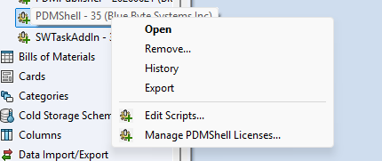
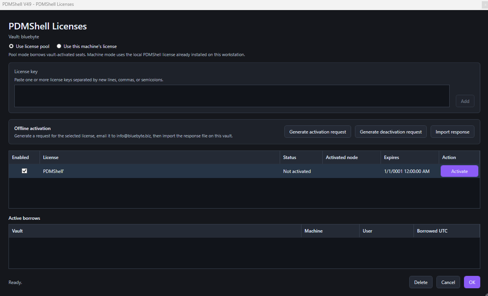

# Manage PDMShell add-in licenses

PDMShell add-in licenses can be managed from the SOLIDWORKS PDM Administration Tool. Use this page when the add-in is installed in a vault and you want pooled add-in licensing, or when you need to choose whether the add-in uses pooled vault seats or the local machine license.

Open the Administration Tool, expand the vault, open the add-ins list, locate the PDMShell add-in, right-click it, and select `Manage PDMShell Licenses`.

  

The `PDMShell Licenses` window opens for the selected vault. Use this window to add license keys, activate pooled keys for the vault, generate offline activation files, choose the license mode, and review active pool borrows.

  

> [!NOTE]
> Restricted or air-gapped vaults that only allow Microsoft-hosted downloads can use the add-in menu command `PDMShell Download Center...` to open the SharePoint folder that contains PDMShell `.cex` files. Use this license manager window for activation; use the Download Center for add-in installer files.

## License mode

The top of the window controls how the vault uses PDMShell licenses.

- `Use license pool` lets the vault borrow from activated license keys stored in the vault.
- `Use this machine's license` uses the local PDMShell license activated in the standalone PDMShell application on the current workstation.

Use standalone PDMShell settings for a license that belongs to one machine. Use this add-in license manager for pooled licenses that should be shared from the vault.

For help choosing a mode, see [License Pool](../license-pool.md) and [Machine License](../machine-license.md).

## Add license keys

Paste one or more PDMShell license keys in the `License key` box. You can separate keys with new lines, commas, or semicolons.

Select `Add` to add the keys to the vault license list.

## Offline activation

Use the `Offline activation` section when the vault cannot reach the Blue Byte Systems license service directly.

1. Select the license row that needs an offline activation or deactivation.
2. Select `Generate activation request` or `Generate deactivation request`.
3. Email the generated request file to `info@bluebyte.biz` with a clear subject such as `PDMShell offline activation request`.
4. When support returns the response file, select `Import response` on the same vault.

Offline request and response files are tied to the selected license and the current vault node. Import the response on the vault where the request was generated.

If you do not receive an activation response, contact `info@bluebyte.biz` for help. This address only replies to activation issues.

## License list

The license list shows the keys available to the vault.

| Column | Meaning |
| --- | --- |
| Enabled | Controls whether the key can be used by the add-in. |
| License | Shows the stored license key. |
| Status | Shows whether the key is activated and ready to use. |
| Activated node | Shows the node or machine that activated the license. |
| Expires | Shows the license expiration date. |
| Action | Lets an administrator activate a license key online when activation is required. |

## Active borrows

The `Active borrows` list shows pool seats currently borrowed from the vault. It includes the vault, machine, user, and borrowed time in UTC.

Use this area to understand who is currently consuming pool seats.

## Window controls

Use the buttons at the bottom of the window to finish or discard changes.

| Button | Meaning |
| --- | --- |
| Delete | Removes the selected license key from the vault license list. |
| Cancel | Closes the window without saving pending changes. |
| OK | Saves the selected license mode, enabled license keys, added keys, removed keys, and other pending license changes. |

Use the `Activate` button in the license list when a license key is present but not activated.

## Related articles

- [License Pool](../license-pool.md)
- [Machine License](../machine-license.md)
- [Offline Activation](../offline-activation.md)
- [PDMShell add-in installation](installation.md)
- [Runtime execution](runtime-execution.md)
