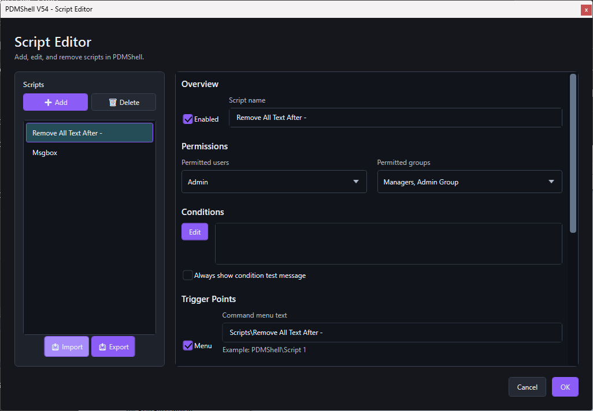
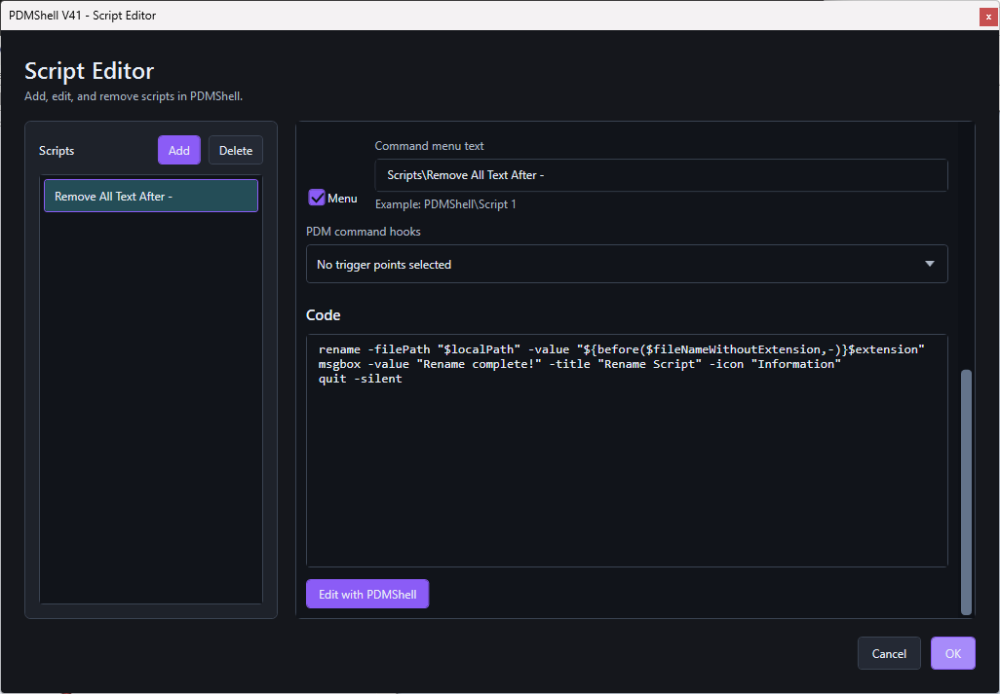
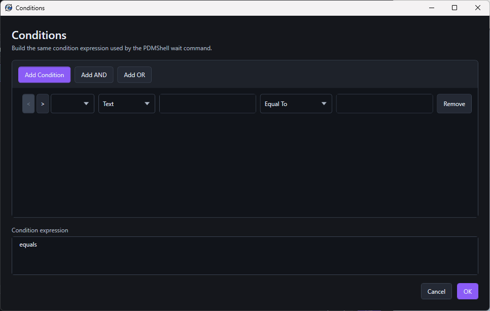
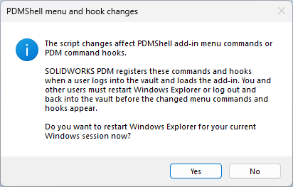

# Script Editor

The Script Editor stores the scripts that the add-in can run from PDM. Each script entry has its own enabled state, permissions, conditions, command menu settings, trigger points, and script code.

## Add-in workflow

Open the SOLIDWORKS PDM Administration Tool, expand the vault, open the add-ins list, locate the PDMShell add-in, right-click it, and select `Edit Scripts...`.

The Script Editor is where administrators create script entries, enable them, assign permitted users and groups, define conditions, configure command menu text, select PDM command hooks, and edit the PDMShell script code.

  

Each script can expose a PDM command menu item and store the PDMShell code that runs against the selected file, folder, or event context.

  

Use the Conditions editor to build the same condition expressions used by PDMShell scripts, then save the expression back to the add-in script.

  

## Add or delete scripts

Use Add to create a new script entry. Use Delete to remove the selected entry.

Use Import to load script entries from a saved configuration file. Use Export to save the configured script entries so they can be backed up, reviewed, or moved to another vault.

The editor does not create dummy scripts. A new script entry is empty until you enter the script name, configuration, and code.

## Save or discard changes

The editor works on a copy of the saved configuration.

- Click OK to save the edited configuration.
- Click Cancel to discard changes made in the dialog.

## Menu and hook changes prompt

When you click OK, PDMShell checks whether the saved changes affect PDM menu command registration or PDM command hook registration.

This prompt appears when changes include command menu changes, command menu name/text changes, or trigger point changes.

  

SOLIDWORKS PDM registers menu commands and command hooks when a user logs in to the vault and the add-in loads. If you changed menu commands or hooks, users must restart Windows Explorer or log out and back in to the vault before the changed commands and hooks appear.

- Click Yes to restart Windows Explorer for the current Windows session.
- Click No if you want to restart Windows Explorer later or log out and back in to the vault manually.

## Script sections

Each script is organized into these sections:

| Section | Purpose |
| --- | --- |
| Overview | Script name and enabled state |
| Permissions | Users and groups allowed to run the script |
| Conditions | Expression that must pass before the script runs |
| Trigger Points | Command menu and PDM event trigger configuration |
| Code | The `.pdmshell` script body |

## Related articles

- [Permissions](permissions.md)
- [Conditions](conditions.md)
- [Command menu scripts](command-menu.md)
- [Event trigger points](trigger-points.md)
