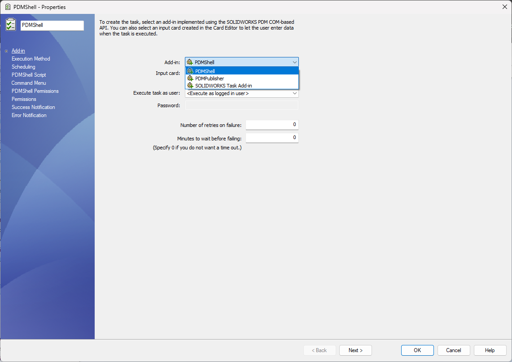
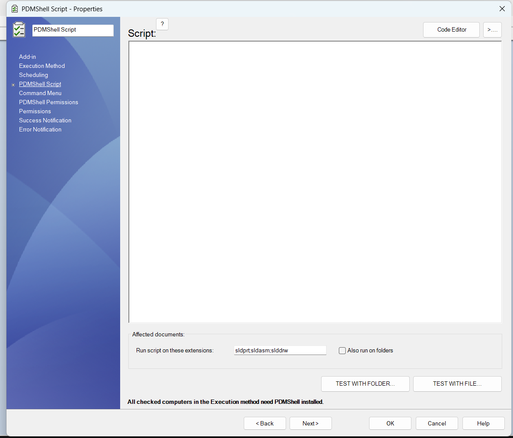
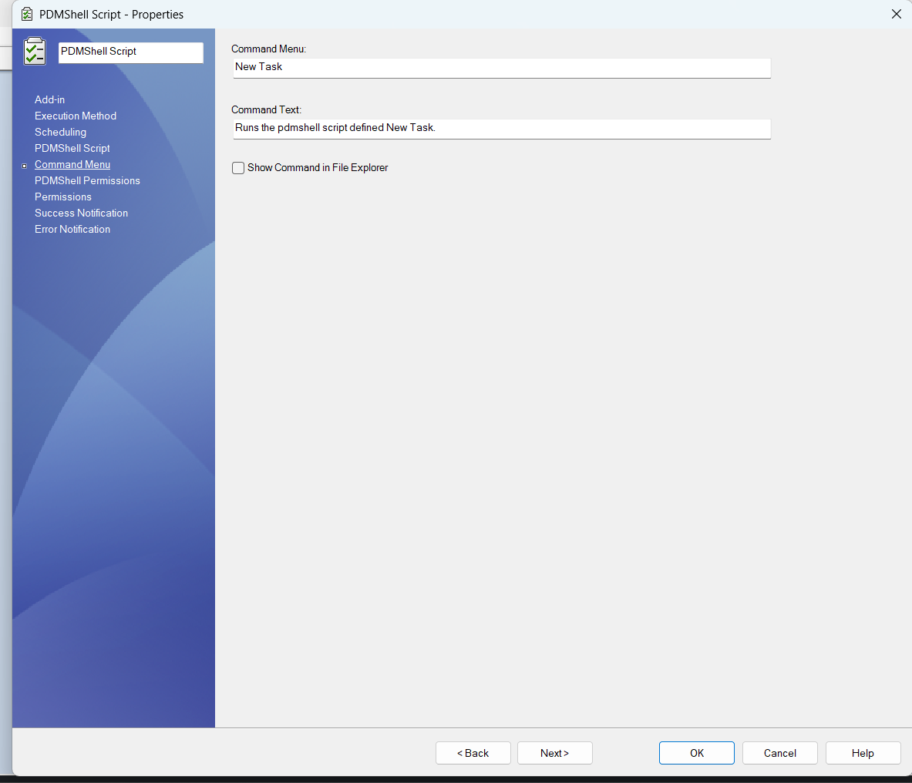
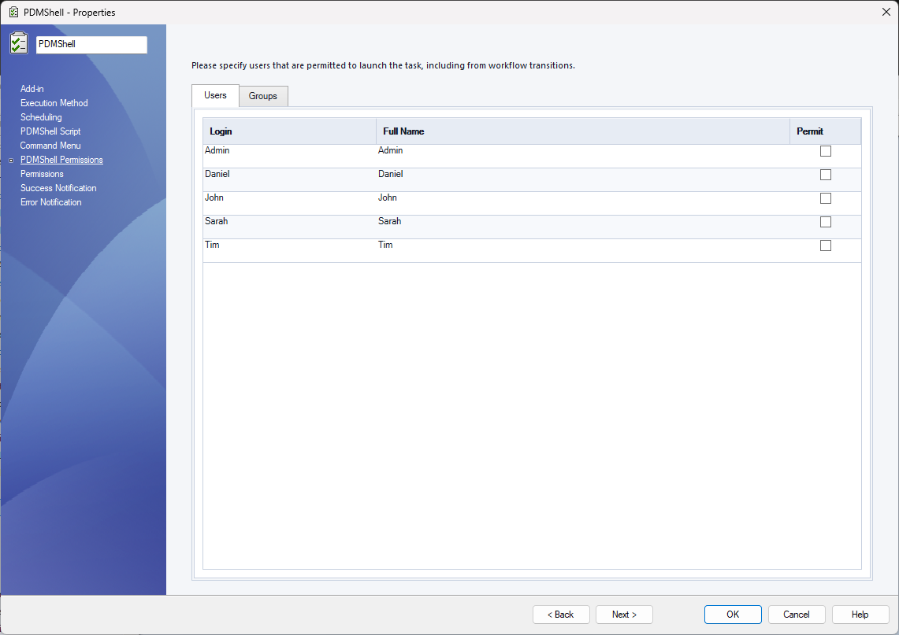

# PDM Tasks

A SOLIDWORKS PDM Task can run a PDMShell script through the PDMShell task add-in. This lets administrators create task definitions similar to the built-in Convert task, but the task body is a `.pdmshell` script instead of a fixed conversion script.

Use a PDMShell task when the automation should run through the PDM task system, appear in the Task List, use task host computers, run from a workflow transition, or process many selected files in the background.

## What PDMShell tasks can do

PDMShell tasks can use the PDMShell command engine to automate vault operations from a PDM task definition.

- Run PDMShell scripts against selected files and folders.
- Use task execution methods and task host computers.
- Run immediately, on a schedule, or from a workflow transition.
- Limit the task to specific file extensions.
- Optionally expose the task in the File Explorer command menu.
- Control which users and groups can launch the task.
- Test scripts against a selected file or folder before saving the task.

## Create a task

In the SOLIDWORKS PDM Administration tool, create a task under the Tasks node. On the Add-in page, select PDMShell as the add-in used by the task.

The standard PDM task pages still control the task shell:

| Page | Use it for |
| --- | --- |
| Add-in | Selecting the PDMShell task add-in and optional input card |
| Execution Method | Choosing which computers can execute the task |
| Scheduling | Running the task immediately, later, or on a schedule |
| Permissions | Controlling who can see, launch, or administer the task |
| Success Notification | Sending task success messages |
| Error Notification | Sending task failure messages |

## PDMShell Script page

The PDMShell Script page is the main PDMShell-specific task page. Enter the script that should run when the task starts.

Use this page to:

- Write or paste the `.pdmshell` script.
- Open the script in the PDMShell code editor.
- Select the file extensions the task should process, such as `sldprt;sldasm;slddrw`.
- Enable folder processing with Also run on folders.
- Test the task script with a selected folder or file.

All computers selected in Execution Method must have PDMShell installed.

## Command Menu page

Use the Command Menu page when users should launch the task from File Explorer.

The command menu name is the label shown to users. Enable Show Command in File Explorer when the task should appear in the PDM right-click menu.

If the task should only run from workflow transitions, scheduled execution, or the Task List, leave the command hidden from File Explorer.

## PDMShell Permissions page

The PDMShell Permissions page controls which users and groups are permitted to launch the PDMShell task, including from workflow transitions.

This page is separate from the standard PDM Permissions page. Use both permission pages together:

| Permission page | Purpose |
| --- | --- |
| PDM Permissions | Standard task visibility, administration, and launch permissions |
| PDMShell Permissions | PDMShell-specific launch permission for this script task |

Start with a small administrator group while testing. Expand access after the script, execution method, and file extension filters have been validated.

## Similar to the Convert task

The PDMShell task follows the same task setup pattern users may already know from the SOLIDWORKS PDM Convert task:

1. Select the task add-in.
2. Choose where the task can execute.
3. Configure scheduling and launch permissions.
4. Define task-specific options.
5. Run the task from File Explorer, workflow transitions, the Task List, or a schedule.

The difference is that PDMShell task logic is written as a PDMShell script. This makes it useful for custom automation such as metadata cleanup, batch variable updates, file exports, migration helpers, reference maintenance, task chaining, and scripted PDM administration.

## Video: create a PDMShell task

  <iframe src="https://www.youtube.com/embed/hn5dfAiYp9g" title="Create a PDMShell task in SOLIDWORKS PDM" allowfullscreen></iframe>

[Watch on YouTube](https://www.youtube.com/watch?v=hn5dfAiYp9g&feature=youtu.be)

## Related articles

- [Runtime execution](runtime-execution.md)
- [Command menu scripts](command-menu.md)
- [Event trigger points](trigger-points.md)
- [Run a PDM task](../RUNTASK.md)
