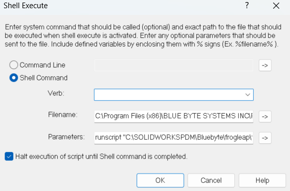

---
description: Learn how to run PDMShell scripts from SOLIDWORKS PDM Dispatch and when to use the PDMShell add-in instead.
title: Run PDMShell Scripts from Dispatch | SOLIDWORKS PDM
---
# Run PDMShell Scripts from Dispatch

When you want to run PDMShell scripts from Dispatch, you can use the **Shell Command** action.

> [!Did You Know?]
> The [PDMShell add-in](TASKSCRIPT.md) can run PDMShell scripts from PDM right-click menus and event trigger points. It covers the same kind of automation you would normally build with Dispatch, and adds permissions, conditions, placeholders, command menu scripts, trigger points, headless execution, and the visual script editor.


## Shell Command Settings



1. **Verb**: Leave this field empty.
2. **Filename**: Specify the path to the PDMShell executable, which is `pdmcli.exe`.  
 > [!NOTE]
 > Do not wrap the path in quotes (`""`), even if it contains spaces.

3. **Parameters**: For current PDMShell versions, use the following format:
   ```bash
   runscript -source "pathToScript" -filePath "%PathToSelectedFile%"
   ```

- The script path must be wrapped in quotes (`""`) if it contains spaces.
- Use `-filePath "%PathToSelectedFile%"` when the Dispatch action is running against the selected PDM file.
- Inside the script, use PDMShell file placeholders such as `$localPath`, `$fileName`, `$fileNameWithoutExtension`, `$extension`, `$folderPath`, and PDM variable placeholders.

## Example: Dispatch Shell Execute Configuration

```bash
Verb:
Filename: C:\Program Files (x86)\BLUE BYTE SYSTEMS INC\PDMShell\PDMCLI.exe
Parameters: runscript -source "C:\Scripts\checkin-selected-file.pdmshell" -filePath "%PathToSelectedFile%"
```

Example script:

In the PDMShell script (`checkin-selected-file.pdmshell`), reference the selected file with `$localPath`:

```bash
# Check out the selected file.
checkout -filePath "$localPath"

# Save changes.
checkin -filePath "$localPath" -comment "Checked in from Dispatch"

# Required when running from Dispatch or another external automation host.
quit
```

## Passing Extra Dispatch Values

> [!WARNING]
> Positional Dispatch values such as `$parameter1$` and `$parameter2$` are legacy behavior and should not be used with PDMShell 4.0.6 or later. Starting with PDMShell 4.0.6, [`runscript`](RUNSCRIPT.md) should receive context through `-filePath`, `-items`, or `-search`, and scripts should use PDMShell placeholders such as `$localPath` instead.

Older scripts may use the positional argument format to pass Dispatch-only values such as `%OldVersion%`:

```bash
Verb:
Filename: C:\Program Files (x86)\BLUE BYTE SYSTEMS INC\PDMShell\PDMCLI.exe
Parameters: runscript "C:\Scripts\frogleap.pdmshell" "%PathToSelectedFile%" "%OldVersion%"
```

In this legacy format, the script used `$parameter1$`, `$parameter2$`, and so on:

```bash
# Check the selected file out.
checkout -filePath "$parameter1$"

# Frog leap to the specified old version.
frogleap -filePath "$parameter1$" -oldVersion "$parameter2$"

# Save changes.
checkin -filePath "$parameter1$" -comment "Prompted version $parameter2$"

# Required when running from Dispatch or another external automation host.
quit
```

For current PDMShell versions, use the `-source` and `-filePath` format shown above. If you need a Dispatch value that is not available as a PDMShell placeholder, write it to a PDM variable, pass a selected file with `-filePath`, or move the automation to the PDMShell add-in where command context and conditions are available.

## Tutorial
 <video src="https://bluebyte.biz/wp-content/pdmshellvideos/dispatch.mp4" autoplay muted controls style="width: 100%; border-radius: 12px;"></video>

## Tips for Running PDMShell Scripts from Dispatch
- Test Your Scripts: Always test your PDMShell scripts independently before integrating them with Dispatch.
- Use Quotes for Paths: Wrap paths and parameters in quotes (`""`) if they contain spaces to avoid errors.
- Use [`quit`](QUIT.md) at the end of scripts launched from Dispatch so the external PDMShell process closes after the script runs.
