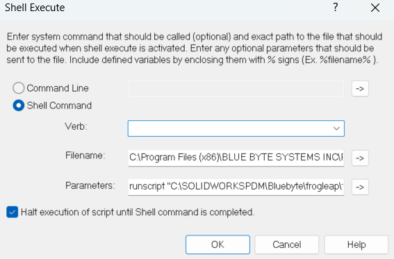

# Notes About Running PDMShell Scripts from Dispatch

When you want to run PDMShell scripts from Dispatch, you can use the **Shell Command** action.


## Shell Command Settings



1. **Verb**: Leave this field empty.
2. **Filename**: Specify the path to the PDMShell executable, which is `pdmcli.exe`.  
 > [!NOTE]
 > Do not wrap the path in quotes (`""`), even if it contains spaces.

3. **Parameters**: Use the following format:  
   ```bash
   runscript "pathToScript" [additional parameters]
   ```

- The pathToScript must be wrapped in quotes ("") if it contains spaces.
- Additional parameters can be passed to the script as needed.

## Example: Dispatch Configuration
Example Command:
```bash
runscript "C:\Scripts\frogleap.pdmshell" "%PathToSelectedFile%" "%OldVersion%"
```

Example Script:

In the PDMShell script (frogleap.pdmshell), you can reference the parameters as follows:

``` bash
# check selected file out
checkout -filePath "$parameter1$"
# frogleap version to specified version 
frogleap -filePath "$parameter1$" -oldVersion "$parameter2$"
# save changes
checkin -filePath "$parameter1$" -comment "prompted version $parameter2$"
# you must call this
quit
```

## Tips for Running PDMShell Scripts from Dispatch
- Test Your Scripts: Always test your PDMShell scripts independently before integrating them with Dispatch.
- Use Quotes for Paths: Wrap paths and parameters in quotes ("") if they contain spaces to avoid errors.
