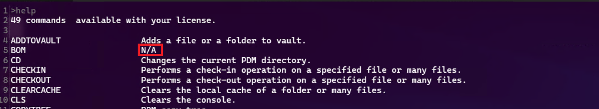

# How to Install/Update PDMShell

PDMShell can be installed or updated from our official website or via the Microsoft Store. For the best experience, we **highly recommend downloading PDMShell from our official website** to ensure you always have the latest version.

> [!NOTE]  
> The Microsoft Store does not automatically update PDMShell. If you installed PDMShell via the Microsoft Store, you may need to uninstall it and reinstall the latest version manually.

---

## Installation Methods

### 1. From Our Website (Recommended)
- Visit our official website to download the latest version of PDMShell:  

  <a href="https://bluebyte.biz/wp-json/slm_custom/downloadpdmshell" class="download-button">⬇️ DOWNLOAD PDMShell LATEST VERSION</a>

- If **Safe Browsing** is turned off in your browser (e.g., Chrome), the installer might be flagged as unverified. Simply click on **Download Anyway** or **Keep** to proceed with the download.

- After downloading, double-click the installer and follow the on-screen instructions to complete the installation.  
  > **Note**: You may need administrative privileges to install PDMShell.

---

### 2. From the Microsoft Store
1. Open the **Microsoft Store** on your Windows device.
2. Search for **PDMShell** in the search bar.
3. Select the PDMShell app from the search results.
4. Click **Get** or **Install** to begin the installation process.
5. Wait for the installation to complete, and then launch PDMShell from the Start menu.

---

## Notes
- **Administrative Privileges**: Depending on your system settings, you may need admin privileges to install PDMShell, especially if installing from the official website.
- **Updates**: The website always contains the latest version of PDMShell. If you installed PDMShell via the Microsoft Store, you may need to manually uninstall and reinstall to get the latest updates.

## Common Update Issues

Sometimes after updating, new commands might show up as `N/A` in the help command. In such case, please uninstall PDMShell and reinstall it to reload the latest resources.  

---

## System Requirements
To ensure PDMShell runs smoothly, your system must meet the following requirements:
- **Operating System**: Windows 10/11
- **SOLIDWORKS PDM Professional**: Version 2014 or newer
- **SOLIDWORKS 3D**: Version 2017 or newer (for commands that use SOLIDWORKS)

---

## Support
For further assistance, visit our [Support Page](https://bluebyte.biz/contact) or contact us at `amen@bluebyte.biz`.