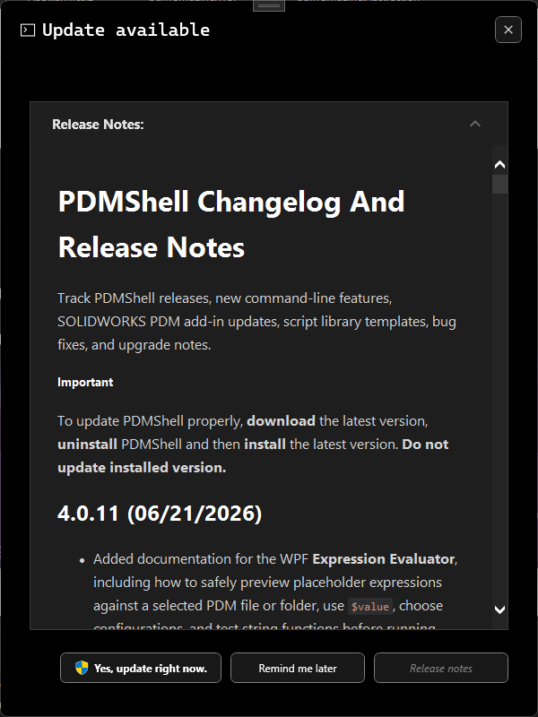
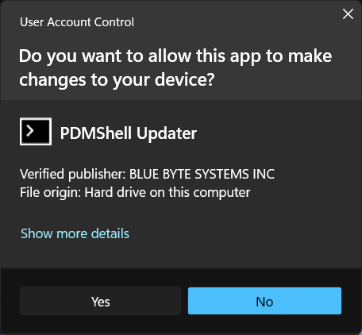
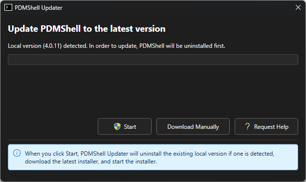
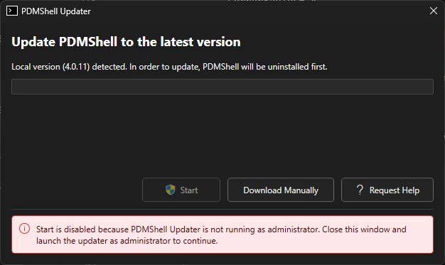
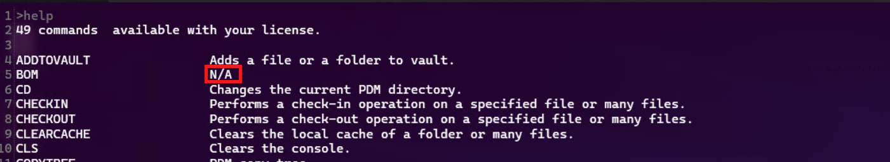

# How to Install/Update PDMShell

PDMShell can be installed from the Blue Byte Systems server or from the Microsoft Store. The Blue Byte Systems server installer is recommended because it provides the latest PDMShell version.

> [!NOTE]
> The in-app updater is available in PDMShell 4.0.12 and newer.

---

## Install From The Blue Byte Systems Server

Download the latest PDMShell installer from the Blue Byte Systems server:

  <a href="https://bluebyte.biz/wp-json/slm_custom/downloadpdmshell" style="display:inline-flex;align-items:center;justify-content:center;padding:12px 22px;border-radius:6px;background:#0078D4;color:#ffffff;text-decoration:none;font-weight:600;border:1px solid #106EBE;">Download PDMShell latest version</a>

If your browser warns that the installer is unverified, choose `Download Anyway` or `Keep` to continue.

  

If Chrome completely blocks the download before it finishes, you can temporarily lower Safe Browsing:

1. Open Chrome.
2. Select the three dots menu in the top-right corner.
3. Go to `Settings` > `Privacy and security` > `Security`.
4. Under `Safe Browsing`, temporarily select `No protection (not recommended)`.
5. Try the PDMShell download again.
6. After the download completes, turn Safe Browsing back on.

After downloading, double-click the installer and follow the on-screen instructions. You may need administrator privileges to install PDMShell.

---

## Install From The Microsoft Store

1. Open the Microsoft Store on your Windows device.
2. Search for PDMShell.
3. Select the PDMShell app from the search results.
4. Select `Get` or `Install`.
5. Wait for the installation to complete.
6. Launch PDMShell from the Start menu.

The Microsoft Store does not automatically update PDMShell. If you installed PDMShell from the Microsoft Store, you may need to uninstall it and reinstall the latest version manually.

---

## Update From Inside PDMShell

PDMShell 4.0.12 and newer can show an Update available dialog when a newer version is detected. The dialog shows the release notes for the latest version.

  

Select `Yes, update right now` to launch PDMShell Updater. Windows may show a User Account Control prompt because the updater needs administrator privileges to uninstall and install software.

  

When PDMShell Updater is running as administrator, the `Start` button is enabled. The updater also shows the local PDMShell version when an installed version is detected.

  

Selecting `Start` will:

1. Uninstall the existing local PDMShell version if one is detected.
2. Download the latest PDMShell installer.
3. Start the installer.

Use `Download Manually` if you prefer to download the installer yourself. Use `Request Help` to open this updater help section.

---

## Run The Updater As Administrator

PDMShell Updater must run as administrator before it can uninstall or install PDMShell. If the updater is not running as administrator, `Start` is disabled and the updater shows a red alert explaining the issue.

Close the updater and launch it as administrator to continue.

  

---

## Fix Update Problems

After an update, new commands may appear as `N/A` in the help command if PDMShell is still loading files from the previous installation. Uninstall PDMShell and reinstall the latest version to refresh the command resources.

  

---

## System Requirements

To ensure PDMShell runs smoothly, your system must meet the following requirements:

- Operating System: Windows 10/11
- SOLIDWORKS PDM Professional: Version 2014 or newer
- SOLIDWORKS desktop application: Version 2017 or newer for commands that use SOLIDWORKS

---

## Support

For further assistance, visit our [Support Page](https://bluebyte.biz/contact) or contact us at `support@bluebytesystemsinc.zohodesk.com`.
