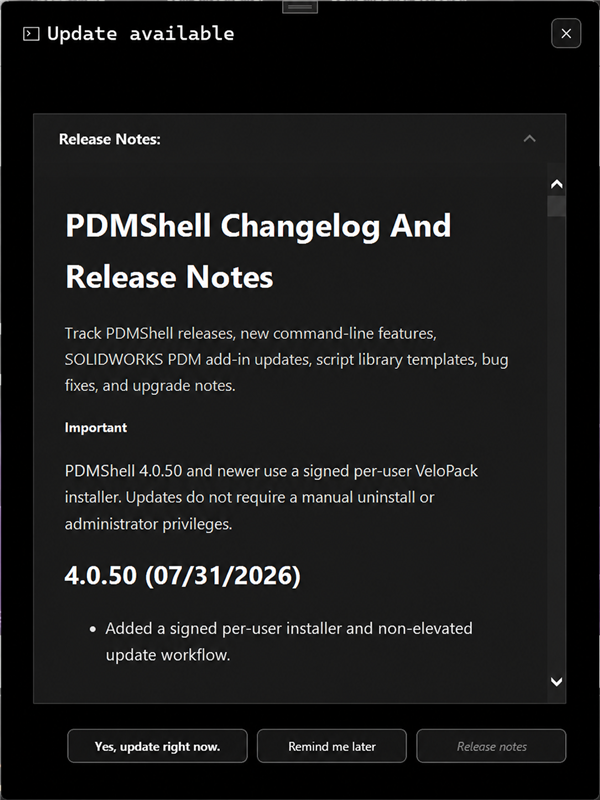

# Install or update PDMShell

PDMShell installs for your Windows account and does not require administrator privileges.

Looking for the SOLIDWORKS PDM add-in instead? See [Install the PDMShell add-in](addin/installation.md).

## Download and install PDMShell

  <a href="https://bluebyte.biz/wp-json/slm_custom/downloadpdmshell" style="display:inline-flex;align-items:center;justify-content:center;padding:12px 22px;border-radius:6px;background:#0078D4;color:#ffffff;text-decoration:none;font-weight:600;border:1px solid #106EBE;">Download the latest PDMShell</a>

The download is a ZIP file containing the signed PDMShell installer.

1. Open your Downloads folder.
2. Right-click `pdmcli_installer.zip` and select **Extract All**.
3. Open the extracted folder.
4. Double-click `pdmcli_installer.exe`.
5. Wait for PDMShell to open.

PDMShell is added to the Start menu and Windows Installed apps. A Desktop shortcut is also created.

## Update PDMShell

When an update is available, PDMShell displays an update message.

  

1. Select **Yes, update right now**.
2. Select **Start** in the updater.
3. Wait while PDMShell downloads and installs the update.
4. The updated version opens automatically.

Your shortcuts and settings are preserved. You do not need to uninstall the previous version first.

If the update is interrupted, close PDMShell and run the update again. You can also use **Download Manually** to install the latest version using the steps above.

## Install from Microsoft Store

1. Open Microsoft Store.
2. Search for **PDMShell**.
3. Select **Get** or **Install**.
4. Open PDMShell from the Start menu.

The website download may receive new versions before the Microsoft Store. If the Store version is older, use the download button on this page.

## System requirements

- Windows 10 or Windows 11
- SOLIDWORKS PDM Professional 2014 or newer
- SOLIDWORKS 2017 or newer for commands that open or process SOLIDWORKS documents

## Need help?

Visit the [Blue Byte Systems support page](https://bluebyte.biz/contact) or email `support@bluebytesystemsinc.zohodesk.com`.
