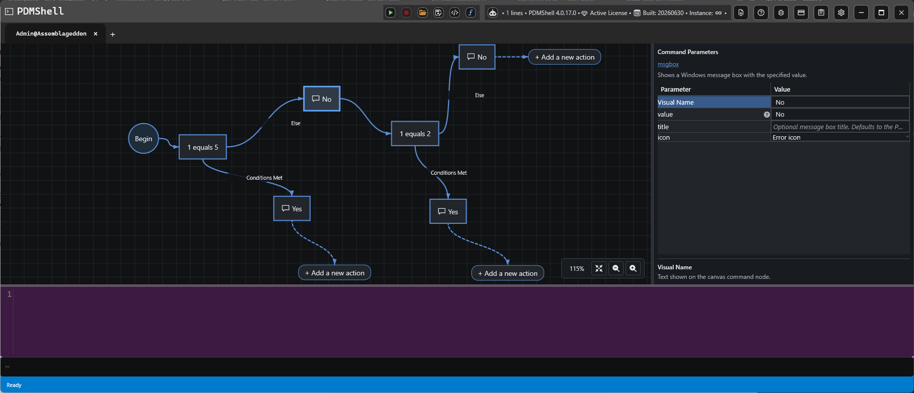
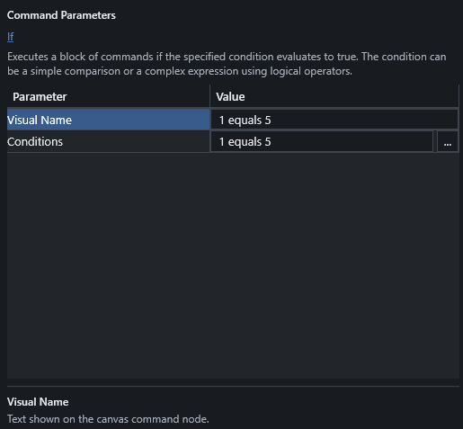
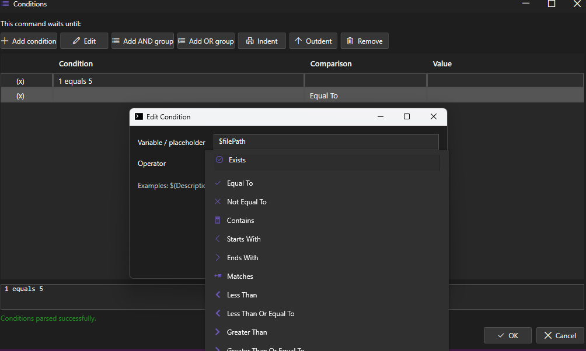

# IF Statements And Conditions

IF statements let a visual script choose between two paths while it is running. Use them when a command should only run when a condition is true, or when a different command should run when the condition is false.

## How IF Branches Work

An IF node evaluates the condition entered in its `Conditions` parameter.

- The `Conditions Met` branch runs when the condition evaluates to true.
- The `Else` branch runs when the condition evaluates to false.
- After a branch finishes, the script continues after the IF block.

This makes it possible to build workflows such as:

- Show one message when a value matches and a different message when it does not.
- Run a command only for files whose names contain a specific value.
- Check whether a file, folder, or process exists before continuing.
- Use nested IF nodes when a second decision depends on the first decision.

## IF Parameters

Select an IF node to edit its parameters.

| Parameter | Description |
| --- | --- |
| `Visual Name` | Text shown on the IF action. |
| `Conditions` | The condition expression that PDMShell evaluates when the script runs. |

The visual name can be short and readable, such as `Is PDF`, `Needs ECO`, or `Revision exists`. The `Conditions` value is the actual expression used by the script.

## Condition Editor

Use the condition editor to build and test condition expressions.

The editor helps you choose the placeholder or value, the comparison operator, and the comparison value. It also shows the generated condition text so you can confirm what will be evaluated.

## Supported Comparisons

Conditions use the shared PDMShell condition syntax. See [Conditions](conditions.md) for the full reference.

Common comparison operators:

| Operator | Example |
| --- | --- |
| `equals` | `1 equals 1` |
| `not equals` | `$fileName not equals "test.pdf"` |
| `contains` | `$fileName contains "ECO"` |
| `starts with` | `$fileName starts with "PRJ"` |
| `ends with` | `$fileName ends with ".pdf"` |
| `matches` | `$fileName matches ".*\\.pdf"` |
| `less than` | `$version less than 5` |
| `greater than` | `$version greater than 1` |
| `exists` | `file "$filePath" exists` |

You can also use `and` and `or` groups for more advanced logic.

## Placeholders In Conditions

Conditions can use [PDMShell placeholders](EVAL.md), including file and folder context values when the script is run for selected items.

Common examples:

| Placeholder | Description |
| --- | --- |
| `$fileName` | Current file name. |
| `$filePath` | Current file path. |
| `$folderName` | Current folder name. |
| `$folderPath` | Current folder path. |
| `$vaultName` | Current vault name. |
| `$revision` | Current file revision when available. |
| `$version` | Current file version when available. |

>[!NOTE]
> File-specific placeholders such as `$fileName`, `$filePath`, `$revision`, and `$version` require a file or folder context. Use Run with selected files, folders, search results, or another item-aware run option when the IF condition depends on selected PDM items.

## Script Execution

When a visual script runs, PDMShell evaluates each IF condition at runtime. Only the matching branch is executed.

Saved visual scripts may contain generated labels and `GoTo` statements behind the scenes. These are used by PDMShell to preserve the visual branch flow during execution. Users normally work with the IF action and its branch connections in the Visual Code Editor.

## Tips

- Keep visual names short so the workflow is easy to read.
- Use the condition editor to validate expressions before running the script.
- Use simple IF nodes first, then add nested IF nodes when the workflow needs a second decision.
- Use placeholders only when the run mode provides the context they need.
