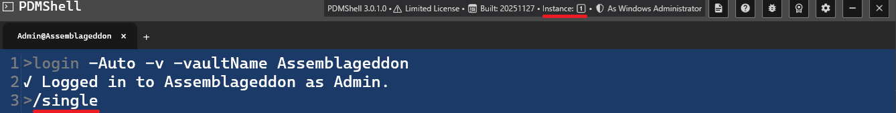
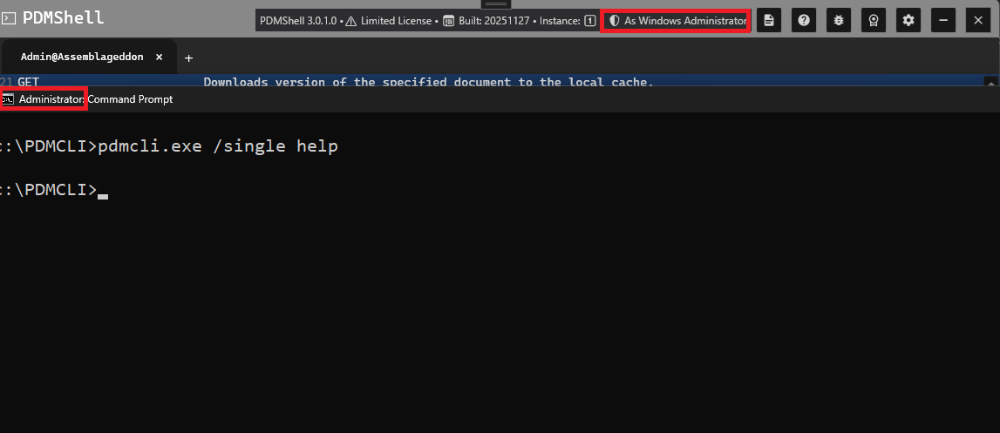

# Notes About Running PDMShell in Single Instance Mode

PDMShell can run in two modes:

- **Multi Instance Mode** (default)
- **Single Instance Mode** (one controller instance, all commands routed to it)

Single instance mode is useful when you want:

- faster execution for multiple commands
- automation pipelines that require sequential execution

---

## Single Instance Mode Overview

To enable **Single Instance Mode**, start PDMShell using:

```bash
pdmcli.exe /single
```

or 

```bash
pdmcli.exe -single
```




When PDMShell is running in **Single Instance Mode**, you’ll see a **single-instance indicator** in the top-right corner of the window. It shows a **“1” icon**, confirming that all commands will be routed to this instance from other **single** instances.

If PDMShell is **not** running in single instance mode, the indicator will display an **infinity symbol (∞)**, meaning **multiple PDMShell instances are allowed** and each command launches independently in its own PDMShell process.

With single instance, you can:

✅ launch PDMShell as a single instance controller  
✅ allow subsequent commands to reuse the same PDMShell instance  
✅ improve performance if triggered from `cmd.exe` or `Dispatch`   
✅ prevent multiple conflicting PDMShell instances

### UAC, Permissions, and Single Instance Mode



PDMShell’s **Single Instance Mode** relies on Windows’ global mutex system.  Because of this, **User Account Control (UAC)** and **process elevation** matter.

To attach to the single instance, you must ensure that:

- If the first instance is started as **Admin**, all following calls must also run **as Admin**
- If the first instance is started **without elevation**, all following calls must also run **without elevation**

> [!Warning]
> Avoid running PDMShell as a Windows Administrator if you have custom add-ins installed.  Check-in and check-out commands can create instances of your add-in inside the host application's memory. If the add-in was registered under a different user or UAC level, PDM will throw a **“Class not registered”** error.

## Executing Commands in Single Instance Mode

Once PDMShell is running with `/single`, **all subsequent calls to `pdmcli.exe` must also include `/single`**, or PDMShell will launch a new instance instead of attaching.

Example:

    pdmcli.exe /single "help command checkout"

This will:

- connect to the already running instance
- execute `help command checkout`
- return output immediately

>[!IMPORTANT]
> When calling from `cmd.exe`, /single or -single cannot be contained in the double quote.

## Headless Mode and Script Startup

Headless mode starts PDMShell with a smaller shell window titled `PDMShell Headless`.

```bash
pdmcli.exe -headless
```

or

```bash
pdmcli.exe /headless
```

Headless mode hides visual-editor controls and status text that are not needed during command execution. It also skips visual-only startup work and online startup license validation. Command-level license checks still run when a licensed command is executed.

PDMShell can also detect a `.pdmshell` script path on the command line and run it through `runscript`.

```bash
pdmcli.exe "C:\Vault\Scripts\CreateECO.pdmshell"
pdmcli.exe "C:\Vault\Scripts\CreateECO.pdmshell" -items "123,45;678,90"
```

Use `-edit` when you want to open the script in the visual editor without running it.

```bash
pdmcli.exe -edit "C:\Vault\Scripts\CreateECO.pdmshell"
pdmcli.exe "C:\Vault\Scripts\CreateECO.pdmshell" -edit
```

## Tips for Single Instance Mode

- Always include `/single` in **every call**
- [Use proper quote escaping when calling from Dispatch](escapingquotes.md)
- Use Single Instance mode for sequences of operations
- Use Multi Instance mode for isolated one-shot commands
