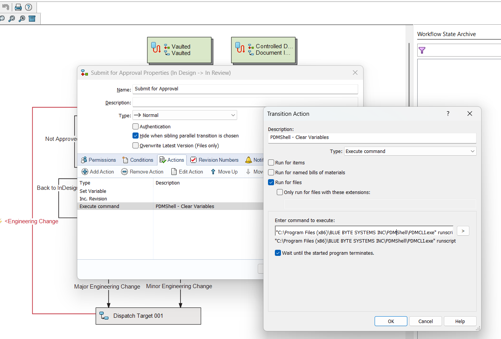

# Notes About Running PDMShell Scripts from Workflow Transitions

When you want to run PDMShell scripts as part of a workflow transition in SOLIDWORKS PDM, you can configure the transition to execute scripts seamlessly. This allows you to automate complex tasks during transitions, such as updating variables, exporting files, or triggering external processes.

## Workflow Transition Configuration



1. **Action Type**: Set the action type to **Execute Command**.
2. **Command**: Specify the path to the PDMShell executable, which is `pdmcli.exe`.  
   ```bash
   "path_to_pdmcli.exe" runscript "pathToScript" [additional parameters]
   ```

- The `pathToScript` must be wrapped in quotes (`""`) if it contains spaces.
- Additional parameters can be passed to the script as needed aslo wrapped in quotes (`""`).
- Make to sure to check `Wait until the started program terminates.`
## Example: Workflow Transition Execute Command Configuration

```bash
"C:\Program Files (x86)\BLUE BYTE SYSTEMS INC\PDMShell\PDMCLI.exe" runscript "C:\Scripts\clearvariables.pdmshell" "FilePath" 
```

### Example Script

In the PDMShell script (`clearvariables.pdmshell`), you can reference the parameters as follows:

```bash
# Check the selected file out
checkout -filePath "$parameter1$"

# clear description variable
setvar -filePath "$parameter1$" -variableName Description -Value ""

# Save changes
checkin -filePath "$parameter1$" -comment "cleared description"
# cd to root folder
cd\
# cd to logs folder
cd logs
# save log
dump clearvariables_$yyyy-$mm-$dd_$guid.txt
# You must call quit at the end of the script
quit
```

## Tutorial
<video src="https://bluebyte.biz/wp-content/pdmshellvideos/workflowtransition.mp4" autoplay muted controls style="width: 100%; border-radius: 12px;"></video>

## Tips for Running PDMShell Scripts from Workflow Transitions
- **Test Your Scripts**: Always test your PDMShell scripts independently before integrating them with workflow transitions.
- **Use Quotes for Paths**: Wrap paths and parameters in quotes (`""`) if they contain spaces to avoid errors.