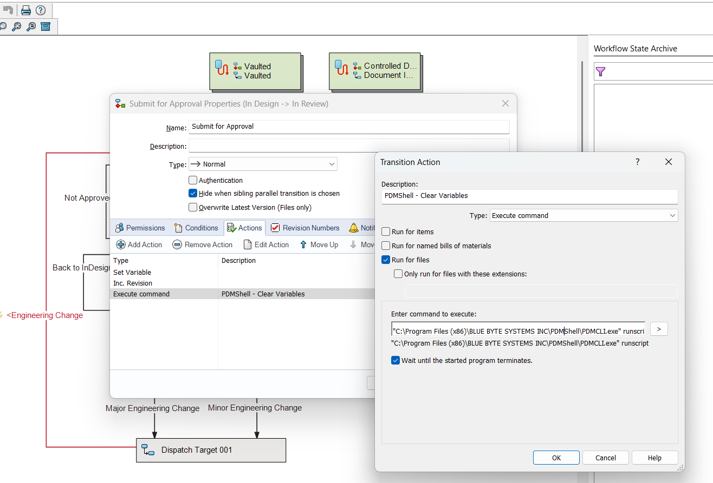

# Run PDMShell Scripts from Workflow Transitions

SOLIDWORKS PDM workflow transitions can run external commands. You can use this to start `pdmcli.exe` and run a `.pdmshell` script when a file moves through a workflow transition.

> [!Did You Know?]
> The [PDMShell add-in](TASKSCRIPT.md) can run PDMShell scripts directly from PDM command menus and event trigger points. For many workflow automations, the add-in is easier than creating a workflow task or external command because it includes permissions, conditions, placeholders, trigger points, headless execution, and the visual script editor.

## Workflow Transition Settings



1. **Action Type**: Set the action type to **Execute Command**.
2. **Command**: Specify the full path to `pdmcli.exe`.
3. **Arguments**: Use `runscript -source` and pass the selected file with `-filePath`.
4. **Wait**: Enable **Wait until the started program terminates**.

Command:

```bash
C:\Program Files (x86)\BLUE BYTE SYSTEMS INC\PDMShell\PDMCLI.exe
```

Arguments:

```bash
runscript -source "C:\Scripts\clearvariables.pdmshell" -filePath "%PathToSelectedFile%"
```

- Wrap the script path in quotes if it contains spaces.
- Use `-filePath "%PathToSelectedFile%"` when the transition runs against the selected PDM file.
- Inside the script, use PDMShell placeholders such as `$localPath`, `$fileName`, `$fileNameWithoutExtension`, `$extension`, `$folderPath`, and PDM variable placeholders.

## Example: Workflow Transition Configuration

```bash
Command: C:\Program Files (x86)\BLUE BYTE SYSTEMS INC\PDMShell\PDMCLI.exe
Arguments: runscript -source "C:\Scripts\clearvariables.pdmshell" -filePath "%PathToSelectedFile%"
```

Example script:

In the PDMShell script (`clearvariables.pdmshell`), reference the selected file with `$localPath`:

```bash
# Check the selected file out.
checkout -filePath "$localPath"

# Clear the Description variable.
setvar -filePath "$localPath" -variableName Description -value ""

# Save changes.
checkin -filePath "$localPath" -comment "Cleared description from workflow transition"

# Optional: save a log.
cd -directory "\"
cd -directory "logs"
dump -filePath "clearvariables_$yyyy-$mm-$dd_$guid.txt"

# Required when running from a workflow transition or another external automation host.
quit
```

## Passing Extra Transition Values

> [!WARNING]
> Positional values such as `$parameter1$` and `$parameter2$` are legacy behavior and should not be used with PDMShell 4.0.6 or later. Starting with PDMShell 4.0.6, [`runscript`](RUNSCRIPT.md) should receive context through `-filePath`, `-items`, or `-search`, and scripts should use PDMShell placeholders such as `$localPath` instead.

Older scripts may use this positional format:

```bash
runscript "C:\Scripts\clearvariables.pdmshell" "%PathToSelectedFile%"
```

In that legacy format, the script used `$parameter1$`:

```bash
checkout -filePath "$parameter1$"
setvar -filePath "$parameter1$" -variableName Description -value ""
checkin -filePath "$parameter1$" -comment "Cleared description"
quit
```

For current PDMShell versions, use the `-source` and `-filePath` format shown above. If the workflow transition needs richer context, conditions, or user/group permissions, use the PDMShell add-in instead of a transition Execute Command action.

## Tutorial

<video src="https://bluebyte.biz/wp-content/pdmshellvideos/workflowtransition.mp4" autoplay muted controls style="width: 100%; border-radius: 12px;"></video>

## Tips

- Test scripts in PDMShell before attaching them to a workflow transition.
- Use [`quit`](QUIT.md) at the end of scripts launched from workflow transitions so the external PDMShell process closes after the script runs.
- Prefer the PDMShell add-in for automations that need conditions, permissions, right-click menu commands, or event trigger points.
