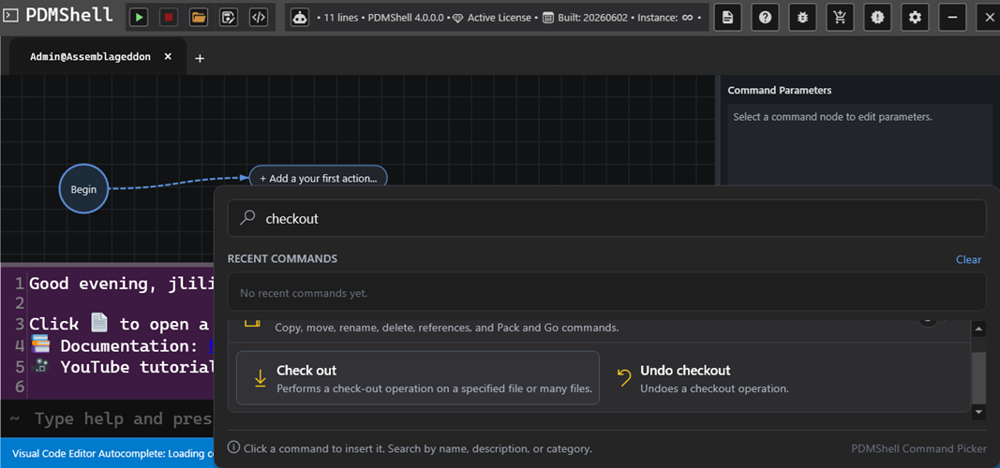
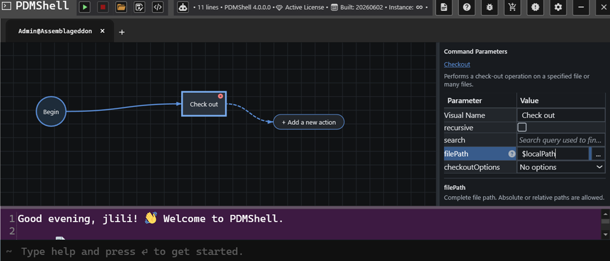
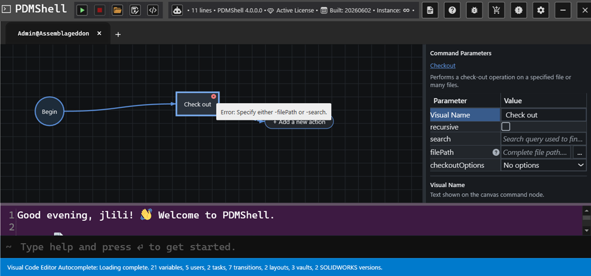

# PDMShell 4.0.0 Visual Code Editor

PDMShell 4.0.0 introduces the **Visual Code Editor**, a workflow-style editor for building PDMShell scripts on a canvas.

Instead of writing every command by hand, you can add command nodes, connect them in order, edit parameters from a side panel, and run the resulting script directly from PDMShell. The command line is still available below the canvas, so advanced users can keep working with text while using the visual editor to organize and validate the workflow.


## Canvas Workflow

The editor starts with a **Begin** node and an action button for adding the first command. Each command becomes a node on the canvas. Nodes are connected in execution order, making the script easier to understand at a glance.



This is especially helpful for longer PDMShell scripts because you can see the process as a flow:

- Start with the current vault context.
- Add one command at a time.
- Connect commands in the order they should run.
- Review the full workflow visually before running it.

## Canvas Navigation

The canvas includes navigation controls for working with larger scripts:

- **Zoom In** increases the canvas scale.
- **Zoom Out** decreases the canvas scale.
- **Zoom To Fit** fits the visible workflow into the canvas view.

These controls are useful when a script grows beyond the visible area or when you want to review the full workflow before running it.

## Command Picker

The command picker lets you search for commands by name, description, or category. Selecting a command inserts it into the canvas as a node.

For example, searching for [`checkout`](CHECKOUT.md) shows related command choices such as **Check out** and **Undo checkout**. This makes discovery easier for users who do not remember the exact command syntax.

## Parameter Panel

When a command node is selected, the **Command Parameters** panel shows the editable parameters for that command.



The parameter grid includes:

- A visual display name for the node.
- Command parameters such as `filePath`, [`search`](SEARCH.md), `recursive`, and command-specific options.
- Inline descriptions for the selected parameter.
- Browse buttons for file and folder parameters when available.

The visual name is only the label shown on the canvas. The real command parameters are still used when PDMShell generates and runs the script.

## Validation

The Visual Code Editor validates command nodes while you build the script.

If a required parameter is missing or incompatible parameters are used together, the node shows an error indicator. Selecting the node shows the validation message so you can fix the command before running it.



For example, the [`checkout`](CHECKOUT.md) command requires either `filePath` or [`search`](SEARCH.md). If neither is set, the editor reports:

```text
Specify either -filePath or -search.
```

This reduces the trial-and-error normally involved in command-line scripting.

## Run Options

The run menu gives multiple ways to execute the visual script:

- **Run** runs the current workflow.
- **Run (Browse to File(s))** runs the workflow against selected files.
- **Run (Search Favorite)** runs the workflow using a saved PDM search favorite.
- **Run (CSV of File Paths)** runs the workflow against a CSV file containing file paths.

These options make the same visual workflow reusable across a single file, a search result, or a batch list.


## Script Library

PDMShell 4.0.0 also includes a script library window for downloading ready-to-use PDMShell scripts and any required SOLIDWORKS macros.


The library is designed to make common automation examples easier to find and reuse. Downloaded PDMShell scripts are saved to the Downloads folder, and macro files are saved to the evaluated temp folder.

## Saving Visual Scripts

Scripts continue to use the `.pdmshell` extension.

In PDMShell 4.0.0, saved scripts can include both:

- The PDMShell script text.
- The visual canvas state, including node positions and visual layout.

This means a script can be reopened later with the visual workflow restored, not just the generated command text.


The editor supports both normal save and Save As workflows. When you open an existing script, PDMShell tracks the current script path so saving can update the same file. Save As lets you write the current script to a different file.

If a script has unsaved changes and you close PDMShell, the application prompts you before closing. This warning is suppressed when PDMShell is launched with the silent mode argument.

Older `.pdmshell` files that contain only script text can still be opened. Newer saved scripts may include encrypted structured data for the script text and canvas visual state.

## When To Use It

Use the Visual Code Editor when:

- You are building a multi-step PDMShell script.
- You want to validate command parameters before running the script.
- You want a clearer view of how commands connect together.
- You want to reuse the same workflow with files, searches, favorites, or CSV input.
- You are helping users who prefer a visual workflow over command-line syntax.

Use the text editor or command line directly when you need quick one-line commands or already know the exact syntax.
