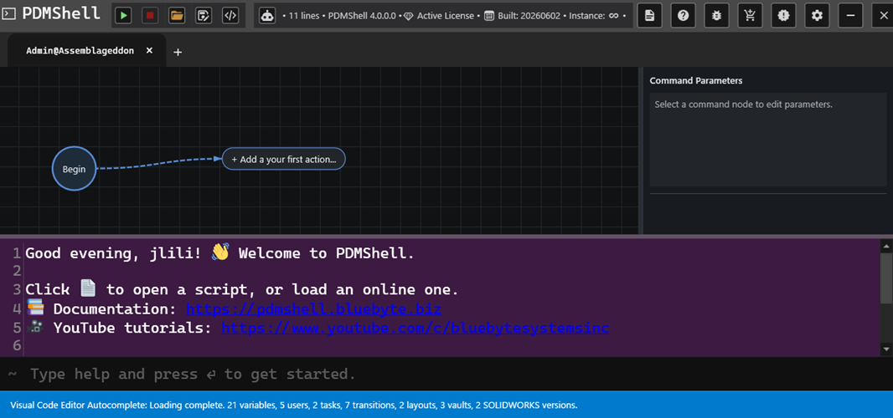

# Visual Code Editor

The Visual Code Editor helps you build PDMShell scripts as connected workflow steps. Instead of writing every command by hand, you can add actions, connect them in the order they should run, edit command settings, validate the workflow, and run it from PDMShell.

The command line is still available below the visual workspace, so experienced users can keep working with text while using the visual editor to organize longer automation workflows.

## What You Can Do

- Build a workflow one action at a time.
- Search for commands by name, description, or category.
- Edit command settings from the selected action.
- Validate required settings before running the workflow.
- Run the workflow normally, against selected files, from a search favorite, or from a CSV file.
- Add [IF statements and conditions](if-statements.md) so the workflow can choose between different paths.
- Save and reopen visual scripts with their visual layout restored.

## Visual Code Editor Articles

| Article | Use it to |
| --- | --- |
| [Build Visual Workflows](visual-editor-build-workflows.md) | Learn how actions connect and how to navigate larger workflows. |
| [Edit Command Settings](visual-editor-command-settings.md) | Understand visual names, command settings, validation, and browse buttons. |
| [Run Visual Workflows](visual-editor-run-options.md) | Choose the right run option for one workflow, selected files, search favorites, or CSV input. |
| [Save And Open Visual Scripts](visual-editor-save-open.md) | Save, reopen, and reuse `.pdmshell` visual scripts. |
| [IF Statements and Conditions](if-statements.md) | Branch the workflow with true and false paths. |

## When To Use It

Use the Visual Code Editor when:

- You are building a multi-step PDMShell script.
- You want to validate command settings before running the script.
- You want a clearer view of how actions connect together.
- You want to reuse the same workflow with files, searches, favorites, or CSV input.
- You are helping users who prefer a visual workflow over command-line syntax.

Use the text editor or command line directly when you need quick one-line commands or already know the exact syntax.
