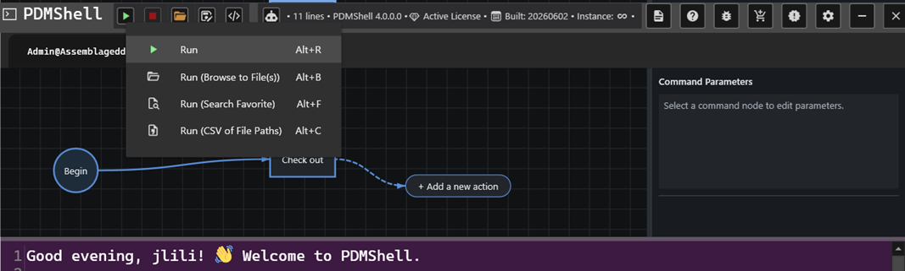
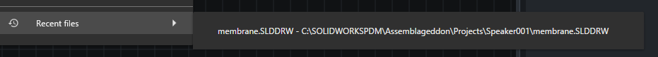

# Run Visual Workflows

The run menu gives you several ways to execute the same visual workflow.

## Run

Use Run when the workflow already contains everything it needs.

This is best for workflows that:

- Log in to a vault.
- Search for files.
- Work from the current vault folder.
- Do not depend on selected files or CSV input.

## Run With Selected Files

Use a selected-file run option when the workflow should repeat file-specific actions for the files or folders you choose.

PDMShell keeps the most recent selected file runs in the `Recent files` menu so you can rerun the same workflow against a recently used file path without browsing again.

This is useful when the workflow uses placeholders such as:

- `$fileName`
- `$filePath`
- `$folderName`
- `$folderPath`
- `$revision`
- `$version`

Each selected item provides its own context while the workflow runs.

## Run With A Search Favorite

Use a search favorite when a saved PDM search should provide the files for the workflow.

This is useful for repeatable jobs such as:

- Processing all files returned by a saved engineering search.
- Running a cleanup workflow against a known search favorite.
- Applying the same workflow to a controlled list of matching files.

## Run With CSV Input

Use CSV input when the workflow should run against paths listed in a file.

This is useful for migration, cleanup, reporting, or batch automation where the list of files is prepared outside PDMShell.

## Choosing The Right Run Option

| Situation | Recommended option |
| --- | --- |
| The workflow is self-contained | Run |
| The workflow depends on selected files or folders | Run with selected files |
| The workflow should use a saved PDM search | Run with a search favorite |
| The workflow should use a prepared file list | Run with CSV input |
