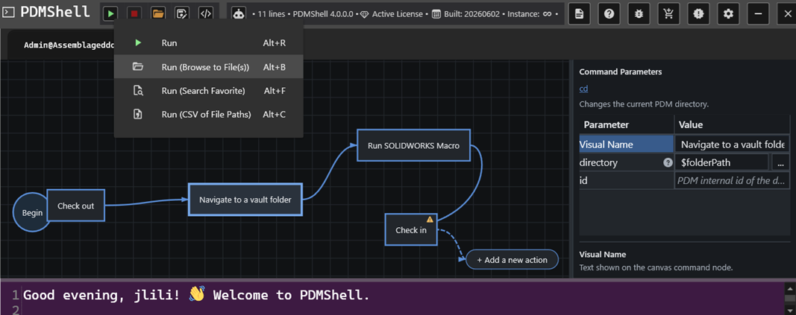
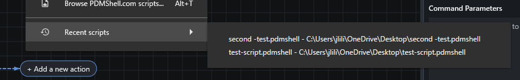
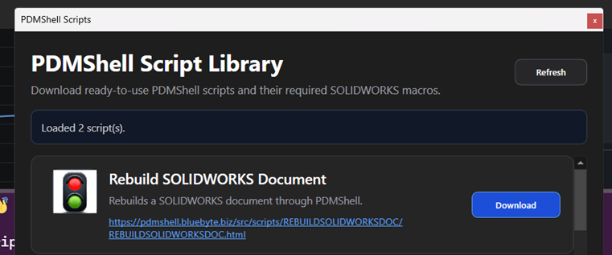

# Save And Open Visual Scripts

Visual scripts use the `.pdmshell` extension.

When you save a visual script, PDMShell stores:

- The PDMShell script text.
- The visual workflow layout.
- Action positions and connections.
- Command settings used by each action.

This lets you reopen the script later with the workflow restored, not just the generated command text.

## Save

Use Save when the script already has a file path. PDMShell updates the existing `.pdmshell` file.

## Save As

Use Save As when you want to save a copy or choose a new file path.

This is helpful when creating a new workflow from an existing one.

## Open Existing Scripts

Older `.pdmshell` files that contain only script text can still be opened. Newer visual scripts may include additional stored workflow information so the visual layout can be restored.

PDMShell keeps the last opened scripts in the `Recent scripts` menu. Use it to reopen a recently edited `.pdmshell` file without browsing back to its folder.

## Unsaved Changes

If a script has unsaved changes and you close PDMShell, the application prompts you before closing.

This helps prevent losing work while building longer workflows.

## Script Library

The Script Library can download ready-to-use PDMShell scripts and any required SOLIDWORKS macros.

Downloaded PDMShell scripts are saved to the Downloads folder. Macro files are saved to the evaluated temp folder.
